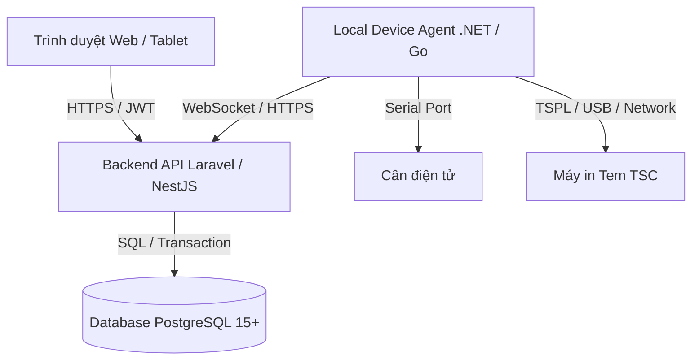

# CLAUDE.md - Chỉ dẫn Phát triển Dự án DF

Tài liệu này đóng vai trò là nguồn sự thật và chỉ dẫn phát triển chính cho mọi phiên Dev và Agent trong quá trình chuyển đổi hệ thống vận hành sản xuất từ Excel VBA + Microsoft Access sang ứng dụng Web PostgreSQL (Dự án DF).

---

## 1. Mục tiêu Dự án
- Chuyển đổi bộ công cụ sản xuất phân tán trên 12 file Excel VBA và 2 database Microsoft Access thành một hệ thống Web tập trung.
- Hiện đại hóa quy trình, loại bỏ phụ thuộc vào môi trường Windows/MS Office cục bộ, đảm bảo tính ổn định, bảo mật và khả năng mở rộng.
- **Nguyên tắc cốt lõi:** Bảo toàn 100% dữ liệu lịch sử và quy tắc nghiệp vụ hữu ích (TraHeSo, công thức tính toán, dung sai, suy luận sự cố) đang chạy tốt trên hệ thống cũ.

---

## 2. Kiến trúc Tổng thể & Công nghệ Dự kiến

Hệ thống được thiết kế theo kiến trúc chia lớp (Layered Architecture):

- **Database:** PostgreSQL 15+ (Schema `legacy_df_data` và `legacy_df_scale` để lưu trữ dữ liệu staging nguyên trạng; schema `app` cho dữ liệu chuẩn hóa của ứng dụng web).
- **Backend API:** Đề xuất Laravel (PHP) hoặc NestJS (TypeScript).
- **Web Frontend:** Đề xuất Vue.js hoặc React (chế độ Wide Layout mặc định, tối ưu hóa hiển thị nhà xưởng).
- **Local Device Agent:** Ứng dụng chạy ngầm trên Windows máy trạm trích xuất cân (qua Serial Port/Putty log) và điều khiển máy in TSC trực tiếp (qua RAW command/Driver).

---

## 3. Quy tắc An toàn Dữ liệu & Môi trường
- **TUYỆT ĐỐI KHÔNG** chạy các lệnh chỉnh sửa cấu trúc hoặc thay đổi dữ liệu trực tiếp trên database Production nếu chưa có văn bản phê duyệt từ chủ dự án và kế hoạch backup cụ thể.
- **TUYỆT ĐỐI KHÔNG** thực hiện thao tác xóa vật lý (Hard Delete) dữ liệu giao dịch hoặc cấu trúc lịch sử. Sử dụng Soft Delete (`deleted_at`) và trạng thái nghiệp vụ.
- **TUYỆT ĐỐI KHÔNG** chỉnh sửa trực tiếp dữ liệu thô trong schema staging (`legacy_df_data`, `legacy_df_scale`). Đây là nguồn sự thật lịch sử phục vụ đối soát (Reconciliation).
- Môi trường phát triển và kiểm thử phải hoàn toàn cô lập với mạng sản xuất thực tế.

---

## 4. Quy trình Phát triển (Workflow)

### Trước khi sửa code
1. Đọc và hiểu rõ miền nghiệp vụ trong [business-modules.md](file:///F:/DF/.claude/business-modules.md).
2. Tra cứu ma trận nguồn trong [source-traceability.md](file:///F:/DF/.claude/source-traceability.md) để biết mã VBA/Access nào tương ứng.
3. Kiểm tra các quyết định thiết kế liên quan trong [architecture-decisions.md](file:///F:/DF/.claude/architecture-decisions.md).

### Sau khi sửa code
1. Chạy toàn bộ Unit test và Integration test của phân hệ liên quan.
2. Thực hiện đối soán Golden Master (so sánh kết quả chạy của Web và Excel VBA trên cùng một tập dữ liệu đầu vào - sai số cho phép của trọng lượng là ±0.000001).
3. Cập nhật nhật ký phiên vào tệp `F:\DF\.claude\session-log.md` theo cấu trúc quy định.

---

## 5. Quy tắc Nghiệp vụ Đặc thù

### Di trú dữ liệu (Migration)
- Phải xử lý triệt để lỗi lệch cột (Column Shift) đã phát hiện ở bảng `tbl_ToSend2` và `WAITING` (Ánh xạ thủ công cột thay vì dùng SQL động chung).
- Toàn bộ dữ liệu import phải được bảo toàn khóa tự nhiên cũ thông qua trường `legacy_id` và lưu vết số dòng nguồn qua `legacy_row_no` phục vụ đối soát.

### Nhật ký Thay đổi (Audit Log)
- 100% các hành động sau phải ghi Audit Log bất biến:
  - Phê duyệt và phát hành phiên bản công thức sản xuất.
  - Override dung sai cân (ghi rõ lý do và tài khoản QA/QC phê duyệt).
  - In lại tem (Reprint) và giải phóng khóa điều phối thủ công (Force Unlock).
  - Thay đổi kho tri thức sự cố (Troubleshooting Knowledge Base).
- Lưu trữ dữ liệu thay đổi dưới định dạng JSONB (`before_data` và `after_data`).

### Tích hợp Thiết bị
- Trình duyệt Web tuyệt đối không được giao tiếp trực tiếp với phần cứng. Mọi thao tác đọc cân và in tem phải đi qua Local Agent.
- Local Agent phải tích hợp cơ chế Offline Queue mã hóa để ghi nhận dữ liệu cân/in tem khi mất kết nối mạng và tự động đồng bộ lại khi có mạng kèm theo cơ chế Idempotency Key chống ghi trùng dữ liệu.
- QR Code phải sinh hoàn toàn nội bộ trong hệ thống Web (không gọi API qrserver.com của bên thứ ba).

---

## 6. Lệnh Bị cấm (Prohibited Commands)
*Lập trình viên và Agent tuyệt đối không tự ý chạy các lệnh sau trừ khi có sự xác nhận rõ ràng của người dùng:*
- `DROP DATABASE ...` hoặc `DROP SCHEMA app CASCADE;`
- Các lệnh xóa file dữ liệu gốc `.accdb`, `.docx` hoặc các tệp `.sql` di trú gốc trong thư mục `sql_migration/`.
- Thực hiện `git push --force` trên các nhánh chính.

---

## 7. Giai đoạn Hiện tại (Current Active Phase)
- **Giai đoạn kích hoạt:** **PHASE 12 – UAT & Chạy song song (Parallel Run Pilot)**
- **PHASE 11 – Báo cáo & Phân tích:** **Đã hoàn thành** (16/07/2026) — 4 báo cáo (tiêu hao, dung sai/override, sản lượng theo ngày/tháng/ca, Pareto sự cố), xuất Excel/PDF, Audit Log Explorer. Sự cố đăng nhập 500 trên DB dev (thiếu bảng `personal_access_tokens` do lệch kiểu dữ liệu UUID/bigint) đã được khắc phục dứt điểm và smoke-test bằng luồng đăng nhập thật. Chi tiết xem [development-roadmap.md](file:///F:/DF/.claude/development-roadmap.md) và [session-log.md](file:///F:/DF/.claude/session-log.md).
  - **Lưu ý còn tồn đọng trước khi UAT (không chặn, cần xác nhận nghiệp vụ):** quy tắc chia ca 3x8h dùng cho báo cáo sản lượng hiện là giả định kỹ thuật, xem `open-questions.md` mục CH-BUS-003.
- **Tái cấu trúc Workstation (mô hình "1 máy tính = 1 công đoạn"):** **Đã hoàn thành WS-001 → WS-012** (16/07/2026) — tài khoản gắn cứng công đoạn, khóa menu, 3 màn hình mới (Quét đơn QR, In tem, Quản lý Workstation), nhập tay fallback khi máy quét lỗi. Chi tiết xem [workstation-redesign-audit.md](file:///F:/DF/.claude/workstation-redesign-audit.md) và `session-log.md` mục 12-13. **Chưa được xác minh bằng mắt trên trình duyệt thật** — cần người dùng tự đăng nhập kiểm tra trước khi coi là hoàn tất.
- **Mục tiêu ngắn hạn (Phase 12):**
  1. Đào tạo nhân viên vận hành song song hệ thống Web và Excel VBA cũ tại phân xưởng pilot.
  2. Triển khai Local Agent tại 2 trạm làm việc mẫu, vận hành thực tế cân/in tem trong 7 ngày liên tục.
  3. Ghi nhận lỗi phát sinh, hiệu chỉnh hệ thống trước khi Cutover (Phase 13).
- **Tài liệu tham khảo chính:** [Bao_cao_phan_tich_thiet_ke_he_thong_tu_VBA.docx](file:///F:/DF/Bao_cao_phan_tich_thiet_ke_he_thong_tu_VBA.docx) và [development-roadmap.md](file:///F:/DF/.claude/development-roadmap.md).

