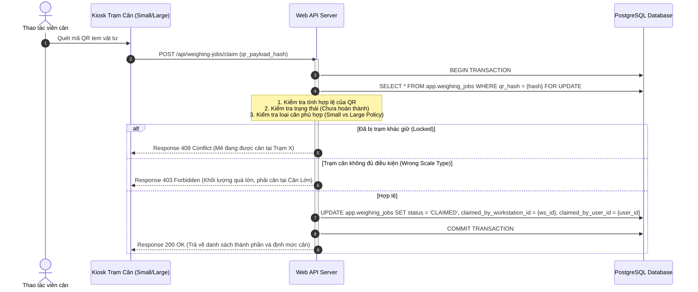

# Quy trình từ Điều phối đến Cân vật tư (dispatch-to-weighing-flow.md)

Tài liệu này đặc tả luồng kết nối nghiệp vụ và an toàn dữ liệu từ thời điểm Trạm in xác nhận điều phối đến khi mã QR được quét và tiếp nhận tại Trạm cân.

---

## 1. Xác nhận điều phối và in nhãn (`ConfirmDispatchRowService`)

### 1.1. Luồng nghiệp vụ gốc trong VBA (DF028)
Trong Workbook `3.DF028  formulas ... - 15l special.xlsm`, tại form gửi lệnh `TO_SEND.frm`, khi người vận hành bấm nút xác nhận dòng (ví dụ slots `OK1..27_Click`), procedure `ConfirmRow` sẽ chạy:
1.  **Ghi lịch sử gửi:** Thực hiện ghi nhận thông tin dòng gửi vào bảng lịch sử `tbl_sentlog` (RECORD_A).
2.  **Cập nhật trạng thái in:** Đánh dấu cột `scale_check` thành `"YES"` (hoặc `TRUE`) trên bảng `tbl_tosend` hoặc `tbl_input_all` (`MarkScaleCheckYes_ByID`).
3.  **Xóa hàng chờ điều phối:** Thực hiện `DELETE` bản ghi đã xử lý ra khỏi hàng chờ điều phối `tbl_tosend`.

### 1.2. Thách thức "Ghi dữ liệu một phần" (Partial Write Risk)
Nếu quá trình này bị mất điện hay lỗi mạng giữa chừng, hệ thống cũ có thể rơi vào các trạng thái lỗi:
- Đã ghi `tbl_sentlog` nhưng chưa cập nhật `scale_check` (dẫn đến mẻ cân bị treo hoặc mất thông tin đối chiếu).
- Đã in tem nhưng database chưa cập nhật (dẫn đến Operator quét tem tại trạm cân bị báo lỗi "Mẻ chưa được in").

### 1.3. Giải pháp trên Web API (`ConfirmDispatchRowService`)
Toàn bộ quy trình `ConfirmRow` được gói gọn trong một Database Transaction thông qua dịch vụ `ConfirmDispatchRowService`:
1.  **BEGIN TRANSACTION**
2.  **Khóa bản ghi điều phối:** `SELECT FOR UPDATE` trên bảng `app.machine_dispatches` để ngăn chặn tranh chấp ghi.
3.  **Cập nhật trạng thái Job điều phối:** Chuyển `queue_state` từ `QUEUED` sang `PRINTED` và thiết lập `scale_checked = true`.
4.  **Sinh Immutable QR Payload:** Ghi nhận chuỗi thô QR đã sinh vào bảng `app.qr_payloads`.
5.  **Tạo lệnh in tem (Print Job):** Chèn bản ghi mới vào bảng `app.print_jobs` để Agent máy in TSC bắt được và in ra nhãn vật lý.
6.  **Cập nhật trạng thái mẻ sản xuất:** Đổi trạng thái mẻ sang `READY_FOR_WEIGHING`.
7.  **COMMIT TRANSACTION**

Nếu bất kỳ bước nào trong chuỗi 7 bước trên bị lỗi, toàn bộ giao dịch sẽ được **Rollback**, tem in không được sinh và trạng thái mẻ giữ nguyên để an toàn tối đa.

---

## 2. Quy trình tiếp nhận lệnh tại Trạm cân (Claim Weighing Job)

Khi Operator cầm nhãn QR đã in đến trạm cân (`SMALL_SCALE` hoặc `LARGE_SCALE`) và quét mã:

### 2.1. Tiến trình quét và tiếp nhận (Claim Job Flow)

### 2.2. Chống tranh chấp đồng thời (Concurrency Claim Guard)
Để đảm bảo **hai trạm cân không bao giờ cùng cân một mẻ hóa chất/thuốc nhuộm**, trường `claimed_by_workstation_id` đóng vai trò là một khóa độc quyền (Exclusive Lock). 
*   Khi trạm `SMALL_SCALE_01` đã claim thành công, bất kỳ yêu cầu claim nào cho cùng mã QR đó gửi từ `SMALL_SCALE_02` đều sẽ bị Backend từ chối ngay lập tức với mã lỗi `409 Conflict`.
*   Trạng thái cân sẽ được cập nhật thời gian thực qua kênh WebSocket để hiển thị dấu khóa (🔒) lên màn hình giám sát của trạm còn lại.
