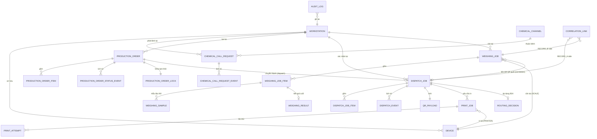

# ERD Mục tiêu — Logical & Physical (erd-target.md)

Lập 2026-07-17 — Phase C/D. Đề xuất THIẾT KẾ — chưa migration, chưa đổi schema thật. Không tạo FK xuyên database legacy (RECORD_A/RECORD_B/WAREHOUSE/CHEM_ORDER/DF_STORAGE chỉ đọc qua Legacy Integration adapter, xem `domain-architecture.md` Mục 1.8).

---

## 1. Logical ERD (quan hệ nghiệp vụ, không phụ thuộc framework)



**Ghi chú đặt tên (đối chiếu chéo, tránh hiểu nhầm 2 nguồn sự thật):** `DISPATCH_JOB`/`WEIGHING_JOB`/`PRODUCTION_ORDER`/`CHEMICAL_CALL_REQUEST` trong sơ đồ Logical ERD ở trên là **tên khái niệm nghiệp vụ**, KHÔNG phải luôn là tên bảng vật lý — bảng vật lý thật nằm ở Mục 2 (Physical ERD). Cụ thể: `DISPATCH_JOB` (logical) = `app.machine_dispatches` (physical, bảng đã có, giữ nguyên tên — xem Mục 2.3); `WEIGHING_JOB` (logical) = `app.weighing_jobs` (physical, đã có, tên khớp); `PRODUCTION_ORDER` (logical) = `app.production_batches` (physical, giữ nguyên tên — xem Mục 2.3); `CHEMICAL_CALL_REQUEST` (logical) = `app.chemical_call_requests` (physical, tên khớp).

**Ghi chú quan hệ quan trọng:**
- `WEIGHING_JOB` liên kết `DISPATCH_JOB` qua `CORRELATION_LINK` (bảng riêng, KHÔNG phải FK trực tiếp) — vì RECORD_A/RECORD_B là 2 hệ độc lập ở phía legacy, chưa có khóa chắc chắn (xem `record-a-record-b-correlation.md`). Đây là quan hệ **suy luận có ghi nhận độ tin cậy**, không phải quan hệ toàn vẹn tham chiếu (referential integrity) cứng.
- `ROUTING_DECISION` là snapshot kết quả tính B24 tại thời điểm confirm — không phải bảng cấu hình (vì B24 không data-driven, xem `b24-warehouse-routing.md`).

---

## 2. Physical ERD (đề xuất — schema `app`, PostgreSQL)

### 2.1. Workstation & Device (mở rộng bảng đã có)

> Cập nhật 2026-07-17 (yêu cầu Menu/Device tiếp theo): schema dưới đây là nguồn sự thật vật lý duy nhất cho 3 tầng **Workstation Type → Workstation Instance → Device** — xem `menu-workstation-device-architecture.md` cho kiến trúc menu/UI dùng các bảng này. Không tài liệu nào khác được định nghĩa lại các bảng này — chỉ tham chiếu bằng tên.

```
app.workstation_types (MỚI — bảng danh mục thay cho enum cứng)
  id smallint PK, code varchar(30) UNIQUE NOT NULL  -- 'CHEMICAL_CALL'|'PRODUCTION_ORDER'|'QR_LABEL_PRINTING'|'SMALL_SCALE'|'LARGE_SCALE'
  display_name varchar(100), is_active boolean DEFAULT true

app.workstations (ĐÃ CÓ — bổ sung cột) — đây là "Workstation Instance" (ví dụ SMALL_SCALE_01, SMALL_SCALE_02)
  ... (giữ nguyên cột hiện có: id, code, name, location, status, created_at, updated_at)
  + workstation_type_id smallint REFERENCES workstation_types(id)  -- thay cho lưu string tự do
  UNIQUE(code)  -- vd. 'SMALL_SCALE_01', 'SMALL_SCALE_02' — 2 dòng riêng biệt cùng workstation_type_id

app.devices (MỚI, thay cho device_assignments đơn giản hiện có — cần đối chiếu lại bảng hiện có trước khi tạo trùng)
  id uuid PK, device_type varchar(20) NOT NULL  -- 'PC'|'PRINTER'|'SCALE'|'SCANNER'|'DISPLAY'|'PLC'|'LOCAL_AGENT'
  name varchar(100), serial_number varchar(100), ip_address inet, hostname varchar(100)
  agent_id uuid NULL  -- FK tới chính nó nếu device_type='LOCAL_AGENT', hoặc tới thiết bị agent phụ trách nếu là PRINTER/SCALE
  driver_protocol varchar(50)       -- 'TSC_TSPL'|'SERIAL_RS232'|'KEYBOARD_WEDGE'...
  status varchar(20) DEFAULT 'PENDING_REGISTRATION'  -- xem state-machines.md Mục 5
  last_heartbeat_at timestamptz
  configuration jsonb NOT NULL DEFAULT '{}'  -- có JSON schema validation ở tầng app, không ở DB — IP/hostname CHỈ là thuộc tính, KHÔNG dùng để định tuyến menu
  agent_version varchar(30)
  is_enabled boolean DEFAULT true
  created_at, updated_at, created_by uuid, updated_by uuid
  UNIQUE(serial_number) WHERE serial_number IS NOT NULL

app.workstation_devices (MỚI — mapping N-N, có role)
  workstation_id bigint REFERENCES workstations(id)
  device_id uuid REFERENCES devices(id)
  role varchar(30)  -- 'PRIMARY'|'BACKUP'|'PC'|'SCANNER'|'AGENT' — mô tả vai trò thiết bị trong trạm này
  PRIMARY KEY (workstation_id, device_id)

app.device_heartbeats (MỚI, time-series, cân nhắc partition theo tháng nếu volume lớn)
  id bigserial PK, device_id uuid REFERENCES devices(id)
  received_at timestamptz NOT NULL, agent_timestamp timestamptz, status varchar(20), payload jsonb

app.device_events (MỚI — audit history riêng cho thiết bị, tách khỏi audit_logs chung để truy vấn nhanh)
  id bigserial PK, device_id uuid REFERENCES devices(id)
  event_type varchar(30), occurred_at timestamptz, detail jsonb

app.workstation_sessions (ĐÃ CÓ theo source-traceability.md — giữ nguyên, không đổi)

-- Quản lý máy in (mục 6 yêu cầu Menu/Device) --
app.printers (MỚI)
  id uuid PK, device_id uuid REFERENCES devices(id)  -- 1 printer luôn gắn 1 device_type='PRINTER'
  printer_name varchar(100) NOT NULL, printer_type varchar(30)  -- 'TSC_TE200'|'TSC_224'...
  driver varchar(50), connection varchar(30)  -- 'USB'|'LAN_9100'
  status varchar(20) DEFAULT 'OFFLINE'

app.printer_profiles (MỚI — thay cho hard-code template/khổ giấy trong code)
  id uuid PK, profile_code varchar(50) UNIQUE NOT NULL  -- vd. 'QR_LABEL_SMALL', 'QR_LABEL_STANDARD_70x100'
  template_key varchar(50) NOT NULL  -- trỏ tới template thật (file/definition riêng, ngoài phạm vi DB)
  paper_size varchar(20), orientation varchar(10) CHECK (orientation IN ('PORTRAIT','LANDSCAPE')), dpi smallint

app.workstation_printers (MỚI — mapping workstation ↔ printer ↔ default template)
  workstation_id bigint REFERENCES workstations(id)
  printer_id uuid REFERENCES printers(id)
  default_printer_profile_id uuid REFERENCES printer_profiles(id)
  priority smallint DEFAULT 1  -- cho phép nhiều printer/1 workstation, ưu tiên thấp hơn dùng khi printer chính lỗi
  PRIMARY KEY (workstation_id, printer_id)

-- Quản lý cân (mục 8 yêu cầu Menu/Device) --
app.scale_devices (MỚI — thay cho hard-code COM3/9600 trong code)
  id uuid PK, device_id uuid REFERENCES devices(id)
  protocol varchar(20) NOT NULL  -- 'SERIAL_RS232'|'TCP'
  port varchar(20), baud_rate integer, unit varchar(10) DEFAULT 'kg', precision smallint DEFAULT 3
  -- workstation↔scale mapping dùng lại app.workstation_devices (role='PRIMARY', device_type='SCALE') — KHÔNG tạo bảng mapping riêng thứ 2 cho scale để tránh 2 nguồn sự thật song song với workstation_devices
```

### 2.2. Chemical Call

```
app.machine_chemical_channels (ĐÃ CÓ — KHÔNG đổi, giữ nguyên vai trò cấu hình tĩnh)

app.chemical_call_requests (MỚI)
  id uuid PK DEFAULT gen_random_uuid()
  channel_id bigint NOT NULL REFERENCES machine_chemical_channels(id)
  machine_id bigint REFERENCES app.machines(id)
  status varchar(20) NOT NULL DEFAULT 'CREATED'  -- xem state-machines.md Mục 1
  requested_at timestamptz, requested_by_user_id uuid REFERENCES app.users(id)
  requested_by_workstation_id bigint REFERENCES app.workstations(id)
  acknowledged_at timestamptz, acknowledged_by_user_id uuid
  confirmed_at timestamptz, confirmed_by_user_id uuid, confirmed_by_workstation_id bigint
  cancelled_at timestamptz, cancelled_reason text
  idempotency_key text NOT NULL
  row_version integer NOT NULL DEFAULT 1
  legacy_source varchar(30) DEFAULT 'tbl_status.Status', legacy_id bigint
  created_at, updated_at
  CONSTRAINT uq_idempotency UNIQUE(idempotency_key)
  CONSTRAINT uq_channel_active_order UNIQUE(channel_id) WHERE status IN ('CREATED','ORDERED','ACKNOWLEDGED')  -- partial unique index, xem Mục 3.1

app.chemical_call_request_events (MỚI)
  id bigserial PK, request_id uuid REFERENCES chemical_call_requests(id)
  event_type varchar(30), occurred_at timestamptz
  actor_user_id uuid, actor_workstation_id bigint
  before_status varchar(20), after_status varchar(20), note text
```

### 2.3. Production Order & Dispatch (mở rộng bảng đã có, KHÔNG tạo trùng)

```
app.production_batches (ĐÃ CÓ — vai trò = production_orders, đối chiếu tên trong domain doc)
  + lock_owner_user_id uuid, lock_workstation_id bigint, lock_acquired_at timestamptz, lock_expires_at timestamptz  -- MỚI, cho lease lock (Mục 4)
  row_version integer (ĐÃ CÓ theo target-data-model.md hiện tại)

app.production_order_status_events (MỚI — tách khỏi audit_logs chung để truy vấn nhanh theo đơn)
  id bigserial PK, order_id uuid REFERENCES production_batches(id)
  from_status varchar(30), to_status varchar(30), occurred_at timestamptz, actor_user_id uuid

app.machine_dispatches (ĐÃ CÓ — vai trò = dispatch_jobs, giữ nguyên tên bảng hiện có)
  ... (giữ cột hiện có: confirm_1/2, sending_value/sent_value, is_sent, scale_checked, raw_qr_dye/chemical, queue_state, locked_by/at)
  + routing_decision_id uuid REFERENCES routing_decisions(id) NULL  -- MỚI

app.dispatch_events (MỚI — tương đương DispatchEvent trong domain-architecture.md, snapshot đầy đủ dòng tại mỗi lần đổi trạng thái, gần nhất với tbl_SentLog thật)
  id uuid PK, dispatch_id uuid REFERENCES machine_dispatches(id)
  event_type varchar(30)  -- 'CONFIRMED'|'SENT'|'CANCELLED'
  color text, code text, machine_id bigint, tank text, level text
  confirm_1 text, confirm_2 text, is_sent boolean, scale_checked boolean
  raw_qr_dye text, raw_qr_chemical text
  occurred_at timestamptz, actor_user_id uuid
  legacy_source varchar(30) DEFAULT 'tbl_SentLog', legacy_id bigint

app.qr_payloads (MỚI)
  id uuid PK, dispatch_id uuid REFERENCES machine_dispatches(id)
  payload_version varchar(10) NOT NULL, payload_type varchar(20) NOT NULL  -- 'DYE'|'CHEM'|'PROCESS'|'EXTRA'|'FB'
  raw_payload text NOT NULL, payload_hash varchar(64) NOT NULL
  routing_decision_id uuid REFERENCES routing_decisions(id)
  template_version varchar(10)
  source_record_id uuid, created_at timestamptz
  CONSTRAINT uq_payload_hash_version UNIQUE(dispatch_id, payload_type, payload_version)

app.routing_decisions (MỚI — snapshot kết quả B24)
  id uuid PK, dispatch_id uuid REFERENCES machine_dispatches(id)
  mode varchar(20) NOT NULL  -- 'LEGACY_EXACT'|'FIXED_D1'|'MANUAL_REVIEW'
  route text, matched_rule varchar(50), rule_version varchar(10)
  input_snapshot jsonb, warnings jsonb, needs_manual_review boolean DEFAULT false
  decided_at timestamptz

app.print_jobs (ĐÃ CÓ theo target-data-model.md cũ — đối chiếu lại, bổ sung nếu thiếu)
  + idempotency_key text UNIQUE, correlation_id uuid, expiry timestamptz, retry_policy jsonb

app.print_attempts (MỚI)
  id bigserial PK, print_job_id uuid REFERENCES print_jobs(id)
  attempt_no smallint, status varchar(20)  -- RECEIVED|PRINTING|PRINTED|FAILED|REJECTED|EXPIRED
  device_id uuid REFERENCES devices(id), started_at timestamptz, finished_at timestamptz, error_detail text
```

### 2.4. Weighing (mở rộng bảng đã có)

```
app.weighing_jobs, app.weighing_job_items (ĐÃ CÓ — giữ nguyên)

app.weighing_samples (MỚI — raw sample, KHÔNG ghi đè khi có override, mục 10.5)
  id bigserial PK, job_item_id uuid REFERENCES weighing_job_items(id)
  device_id uuid REFERENCES devices(id)
  sequence_no bigint NOT NULL, device_timestamp timestamptz, agent_timestamp timestamptz, server_received_at timestamptz
  raw_value text, cleaned_value numeric(18,6), unit varchar(10)
  is_stable boolean, quality_code varchar(20)
  scale_algorithm_version varchar(10)
  CONSTRAINT uq_device_sequence UNIQUE(device_id, sequence_no)  -- chống duplicate

app.weighing_results (MỚI — business result, tách khỏi raw sample)
  id uuid PK, job_item_id uuid REFERENCES weighing_job_items(id)
  stable_reading_id bigint REFERENCES weighing_samples(id)
  final_value numeric(18,6), tolerance_status varchar(10)  -- ACCEPTED|WARNING|REJECTED
  is_override boolean DEFAULT false, override_reason text, override_by_user_id uuid
  posted_at timestamptz
  policy_version varchar(10)

app.weighing_events (MỚI)
  id bigserial PK, job_item_id uuid, event_type varchar(30), occurred_at timestamptz, actor_user_id uuid
```

### 2.5. Traceability

```
app.correlation_links (MỚI — xem record-a-record-b-correlation.md)
  id uuid PK
  dispatch_id uuid REFERENCES machine_dispatches(id)
  weighing_job_id uuid REFERENCES weighing_jobs(id)
  match_method varchar(20)  -- 'EXACT'|'DETERMINISTIC_COMPOSITE'|'PROBABILISTIC'|'MANUAL'
  confidence numeric(3,2)   -- 0.00–1.00, NULL nếu EXACT
  matched_on jsonb          -- các trường dùng để match (color, code, machine, timestamp window...)
  status varchar(20) DEFAULT 'LINKED'  -- 'LINKED'|'EXCEPTION_QUEUE'|'REJECTED'
  created_at timestamptz

app.legacy_exception_queue_items (MỚI)
  id uuid PK, entity_type varchar(30), entity_id uuid, reason text, created_at timestamptz, resolved_at timestamptz, resolution text
```

---

## 3. Ràng buộc (Constraint) bắt buộc xem xét (mục 15.1)

| Bảng | Constraint | Lý do |
|---|---|---|
| `workstations` | `UNIQUE(code)` | Đã có |
| `devices` | `UNIQUE(code)` | Mã thiết bị duy nhất toàn hệ |
| `chemical_call_requests` | `UNIQUE(idempotency_key)` | Chống double-submit |
| `chemical_call_requests` | `UNIQUE(channel_id) WHERE status IN ('CREATED','ORDERED','ACKNOWLEDGED')` | Tại 1 thời điểm, 1 kênh chỉ có tối đa 1 request đang mở — đúng bản chất VBA gốc (1 đèn tín hiệu = 1 trạng thái) |
| `machine_dispatches` | Giữ `UNIQUE(source_table, legacy_row_no)` đã có | — |
| `qr_payloads` | `UNIQUE(dispatch_id, payload_type, payload_version)` | Payload hash/version duy nhất theo loại |
| `print_jobs` | `UNIQUE(idempotency_key)` | Chống in trùng khi retry |
| `print_attempts` | `UNIQUE(print_job_id, attempt_no)` | Sequence lần thử |
| `weighing_samples` | `UNIQUE(device_id, sequence_no)` | Chống duplicate sample khi Agent gửi lại |

---

## 4. Ghi chú soft-delete / audit timestamp (mục 15)

Áp dụng `created_at/updated_at/created_by/updated_by` cho MỌI bảng giao dịch mới. **Soft delete (`deleted_at`) chỉ áp dụng cho bảng có khả năng "xóa" theo nghiệp vụ thật** (ví dụ `production_batches` nếu hủy đơn) — KHÔNG thêm `deleted_at` vào bảng log bất biến (`dispatch_events`, `weighing_samples`, `chemical_call_request_events`) vì bản chất là append-only, không bao giờ xóa/sửa.
