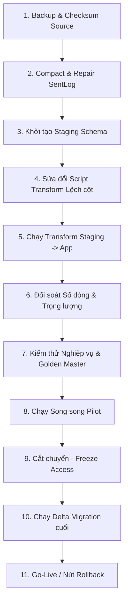

# Migration Strategy - Chiến lược Chuyển đổi Dữ liệu

Tài liệu này đặc tả quy trình từng bước để di trú dữ liệu lịch sử từ hai cơ sở dữ liệu Microsoft Access nguồn sang PostgreSQL 15+, sửa đổi các lỗi lệch cột dữ liệu và lập kế hoạch cutover/rollback an toàn.

---

## 1. Quy trình Di trú Dữ liệu 11 Bước



### Bước 1: Sao lưu và Khóa nguồn (Backup & Checksum)
- Lưu trữ hai tệp Access nguồn vào thư mục backup read-only:
  - `RECORD.accdb` (SHA-256: `456d481142f97315fc7d92b5befb87b2973af7e3df6e74f822bbd53e55bb4dff`)
  - `RECORD(1).accdb` (SHA-256: `1afca8455e8552f0db059670d92065eda2de5675ea8800e9913d9e88914e3aba`)
- Chụp ảnh checksum và cam kết không sửa đổi trực tiếp trên hai file gốc này.

### Bước 2: Cứu hộ dữ liệu `tbl_SentLog`
- Mở bản sao của tệp `RECORD.accdb` trên phần mềm Microsoft Access.
- Thực hiện công cụ **Compact & Repair Database** tích hợp sẵn của Access để sửa lỗi hỏng trang dữ liệu (overflow page error) trên bảng `tbl_SentLog`.
- Thực hiện export riêng bảng `tbl_SentLog` sau khi sửa sang định dạng CSV (UTF-8) hoặc tệp ACCDB mới.
- Cập nhật tệp import SQL để nạp dữ liệu bổ sung của `tbl_SentLog` vào PostgreSQL staging.

### Bước 3: Khởi tạo Staging Schema
- Tạo cơ sở dữ liệu đích `production_web`.
- Chạy lệnh nạp import:
  `psql -v ON_ERROR_STOP=1 -d production_web -f 01_legacy_access_import_postgresql.sql`
- Lệnh này tạo schema `legacy_df_data` và `legacy_df_scale` lưu giữ nguyên vẹn dữ liệu Access thô.

### Bước 4: Sửa đổi Script Transform để giải quyết lỗi Lệch cột
> [!IMPORTANT]
> **Khắc phục lỗi lệch cột:** Cần chỉnh sửa tệp `03_transform_legacy_to_target.sql`. Phải tách bảng `tbl_ToSend2` và `WAITING` ra khỏi vòng lặp động hiện tại và thực hiện ánh xạ thủ công như sau:

#### Ánh xạ Sửa lỗi cho `tbl_ToSend2`:
```sql
INSERT INTO app.machine_dispatches(
  legacy_row_no, legacy_id, batch_id, 
  confirm_1, confirm_2, sending_value, sent_value, 
  confirmed_at_1, confirmed_at_2, sent_at, 
  is_sent, scale_checked, queue_state, source_table
)
SELECT 
  row_number() OVER (), 
  d."ID", 
  b.id, 
  d."MACHINE"::text,  -- Mapped from MACHINE (contains OK) -> confirm_1
  d."SENDING"::text,  -- Mapped from SENDING (contains OK) -> confirm_2
  d."SENT"::text,     -- Mapped from SENT (contains 0) -> sending_value
  d."TIME1"::text,    -- Mapped from TIME1 (contains 0) -> sent_value
  -- Sử dụng to_timestamp để parse chuỗi thời gian text an toàn, tránh lỗi cast trực tiếp
  CASE WHEN d."TIME2" IS NOT NULL AND d."TIME2" != '0' THEN to_timestamp(d."TIME2", 'MM/DD/YYYY HH24:MI:SS') ELSE NULL END, -- -> confirmed_at_1
  CASE WHEN d."TIME3" IS NOT NULL AND d."TIME3" != '0' THEN to_timestamp(d."TIME3", 'MM/DD/YYYY HH24:MI:SS') ELSE NULL END, -- -> confirmed_at_2
  NULL, -- sent_at
  d."ISSENT", -- is_sent
  NULL, -- scale_checked
  'TO_SEND', 
  'tbl_ToSend2'
FROM legacy_df_data."tbl_ToSend2" d
LEFT JOIN app.machines m ON m.code = trim(d."TANK"::text) -- Mapped from TANK (contains Machine) -> machines
-- Join thông qua Product Code thực sự nằm ở cột CONFIRM1
LEFT JOIN app.production_batches b ON b.product_code = trim(d."CONFIRM1"::text) AND b.machine_id = m.id;
```

#### Ánh xạ Sửa lỗi cho `WAITING`:
```sql
INSERT INTO app.machine_dispatches(
  legacy_row_no, legacy_id, batch_id, 
  confirm_1, confirm_2, queue_state, source_table
)
SELECT 
  row_number() OVER (), 
  NULL, 
  b.id, 
  d."CODE"::text, -- Mapped from CODE (contains OK) -> confirm_1
  d."CONFIRM2"::text, -- confirm_2
  'WAITING_LEGACY', 
  'WAITING'
FROM legacy_df_data."WAITING" d
LEFT JOIN app.machines m ON m.code = trim(d."CONFIRM1"::text) -- Mapped from CONFIRM1 (contains Machine) -> machines
-- Join thông qua Product Code thực sự nằm ở cột COLOR
LEFT JOIN app.production_batches b ON b.product_code = trim(d."COLOR"::text) AND b.machine_id = m.id;
```

#### Ánh xạ cấu hình Kênh hóa chất `tbl_status`:
```sql
INSERT INTO app.machine_chemical_channels(machine_id, channel_number, chemical_code, legacy_id)
SELECT 
  m.id, 
  d.chem, 
  trim(d.chem_name), 
  d.ID
FROM legacy_df_scale.tbl_status d
JOIN app.machines m ON m.code = trim(d.machine)
ON CONFLICT (machine_id, channel_number) DO UPDATE 
SET chemical_code = EXCLUDED.chemical_code, legacy_id = EXCLUDED.legacy_id;
```

- **Lưu ý múi giờ:** Thiết lập `SET TimeZone = 'Asia/Ho_Chi_Minh';` and `SET datestyle = 'ISO, MDY';` trước khi chạy script transform.


### Bước 5: Chạy Transform & Đối soát (Validation)
- Thực thi script transform đã hiệu chỉnh.
- Chạy tệp đối soát `04_validation_queries.sql`.
- **Tiêu chuẩn đạt (Acceptance criteria):**
  - Khớp 100% tổng số dòng thuốc nhuộm di trú (140,660 dòng `tblRECORD` nguồn -> 140,660 dòng `scale_measurements` loại DYE).
  - Khớp 100% tổng số dòng hóa chất di trú (5,061 dòng `tblRECORD_chem` -> 5,061 dòng `scale_measurements` loại CHEMICAL).
  - Không có dòng nào bị lỗi kiểu dữ liệu (Timestamp / Decimal).
  - Không có khóa trùng lặp ngoài ý muốn trong `machine_dispatches`.

### Bước 6: Nghiệm thu UAT & Đối chiếu Golden Master
- Kiểm tra tính nhất quán của kết quả tính toán TraHeSo của ứng dụng Web với Excel VBA thô trên bộ dữ liệu kiểm thử 50 mẻ mẫu điển hình. Sai số cho phép của lượng cân bột màu là `0.0`.

### Bước 7: Chạy song song (Parallel Run)
- Chọn 1 khu vực cân và 1 máy nhuộm làm pilot trong vòng 1-2 tuần.
- Vận hành viên thực hiện ghi nhận trên cả Excel Macro cũ và Web mới.
- So sánh nội dung QR code sinh ra và tệp in tem TSC để đảm bảo khớp thông tin 100%.

### Bước 8: Khóa ghi Access và Cắt chuyển (Freeze & Cutover)
- Vào ngày cutover, đổi quyền file `.accdb` cũ sang Read-Only (Freeze).
- Chạy lần đồng bộ cuối cùng (Delta Migration) để quét các bản ghi phát sinh trong ca làm việc cuối.
- Khởi động Local Agent kết nối tới Backend API mới tại các máy trạm.
- Tuyên bố Go-Live hệ thống Web.

---

## 2. Kế hoạch Quay lui (Rollback Plan)
- **Điều kiện Rollback:** Hệ thống Web bị lỗi mất dữ liệu giao dịch mới, Local Agent không kết nối được cân làm đình trệ sản xuất quá 2 tiếng mà không có cách khắc phục nhanh.
- **Quy trình thực hiện:**
  1. Tắt Local Agent tại các trạm.
  2. Mở lại quyền ghi (Read-Write) cho các file Access `.accdb` cũ.
  3. Yêu cầu vận hành viên mở lại các workbook Excel VBA cũ để tiếp tục sản xuất.
  4. Thực hiện delta migration thủ công phần dữ liệu ghi nhận trên Web trong 2 tiếng lỗi về lại Access (nếu có dữ liệu phát sinh).

---

## 3. Lưu trữ Lịch sử (Archive Policy)
- Toàn bộ các bảng trong schema `legacy_df_data` và `legacy_df_scale` được **GIỮ LẠI VĨNH VIỄN** trong database PostgreSQL sản xuất dưới dạng Read-Only.
- Không xóa các schema staging này sau khi go-live thành công vì đây là bằng chứng đối soát pháp lý và dữ liệu thô phục vụ kiểm toán sau này.
