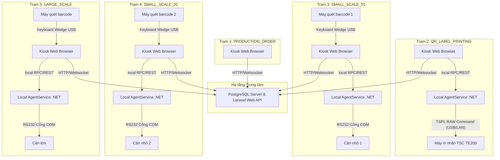

# Kiến trúc vật lý & Topology mạng các máy trạm Non-Chemical (non-chemical-runtime-topology.md)

Tài liệu này đặc tả topology mạng và mô hình vận hành vật lý của 5 máy trạm nghiệp vụ sản xuất chính (không bao gồm CHEMICAL_CALL). Mỗi máy trạm được thiết kế theo nguyên tắc: độc lập dữ liệu, độc lập phần cứng và cô lập phiên làm việc.

---

## 1. Sơ đồ Topology mạng vật lý

---

## 2. Đặc tả các thành phần và Kết nối mạng

### 2.1. Central Web Server & Database
- **Địa chỉ API:** Tập trung (ví dụ: `http://192.168.1.10:8002/api`).
- **Giao thức kết nối:** HTTPS (REST API cho các cuộc gọi thông thường) và WebSocket (để đẩy thông tin trạng thái cập nhật thời gian thực).
- **Trạng thái:** Không lưu trữ trạng thái phiên làm việc cục bộ của thiết bị cân ở server (Stateless Backend). Mọi trạng thái tạm thời của lượt cân do máy trạm lưu giữ.

### 2.2. Trạm Tạo đơn sản xuất (PRODUCTION_ORDER - 1 instance)
- **Thiết bị:** Máy tính văn phòng (Back-office PC).
- **Mã trạm:** `WS-ORDER-01`.
- **Kết nối phần cứng:** Chỉ sử dụng bàn phím/chuột thông thường, không kết nối trực tiếp thiết bị cân hay máy in tem. Kết nối mạng qua HTTP/HTTPS lên server trung tâm.

### 2.3. Trạm Nhận đơn & In nhãn QR (QR_LABEL_PRINTING - 1 instance)
- **Thiết bị:** Máy tính Kiosk đặt tại phòng điều phối/in nhãn.
- **Mã trạm:** `WS-PRINT-01`.
- **Kết nối máy in:** 1 máy in tem TSC TE200 kết nối qua cổng USB cục bộ hoặc qua địa chỉ IP LAN tĩnh.
- **Local Agent:** Chạy ngầm dưới quyền Windows Service tại Kiosk, mở một cổng REST API cục bộ (`http://localhost:5000`) để nhận lệnh in từ trình duyệt và biên dịch sang tập lệnh TSPL thô đẩy thẳng vào driver/port máy in.

### 2.4. Trạm Cân nhỏ (SMALL_SCALE - 2 instances hoạt động độc lập)
- **Mã trạm:** `WS-SMALL-01` và `WS-SMALL-02`.
- **Thiết bị vật lý:** 2 bộ máy tính Kiosk độc lập hoàn toàn, đặt tại hai bàn cân trợ chất khác nhau.
- **Mỗi trạm cân nhỏ có riêng:**
  - **IP & MAC riêng:** Đăng ký độc lập trên router.
  - **Scale Device riêng:** Ví dụ trạm 1 dùng cân OHAUS Defender, trạm 2 dùng cân Shinko.
  - **Local Agent riêng:** Chạy độc lập trên từng máy trạm. Agent 1 chỉ đọc cổng COM máy 1, Agent 2 chỉ đọc cổng COM máy 2.
  - **Scanner riêng:** Kết nối USB giả lập bàn phím (Keyboard Wedge). Khi quét mã QR, dữ liệu được gửi trực tiếp vào ô input hoạt động của trình duyệt trạm đó.
  - **Weighing Session riêng:** Backend theo dõi phiên làm việc theo `workstation_id` khác nhau, đảm bảo dữ liệu cân của trạm 1 không bao giờ bị ghi đè hoặc nhầm lẫn sang trạm 2.

### 2.5. Trạm Cân lớn (LARGE_SCALE - 1 instance)
- **Thiết bị:** Máy tính Kiosk đặt cạnh cân sàn lớn (đo đạc các mẻ cân hóa chất phụ trợ khối lượng lớn).
- **Mã trạm:** `WS-LARGE-01`.
- **Đặc thù cân lớn:** Sử dụng cân sàn tải trọng lớn (COM port truyền thông điệp riêng). Quy trình cân tương tự cân nhỏ nhưng sử dụng chính sách kiểm tra sai số và dung sai riêng (LargeScalePolicy).

---

## 3. Cơ chế cô lập và an toàn dữ liệu
1. **Cô lập Local Agent:**
   - Agent của máy trạm nào chỉ chịu trách nhiệm lắng nghe cổng COM vật lý gắn trực tiếp vào máy trạm đó.
   - Trình duyệt Chrome của Kiosk chỉ kết nối tới Agent cục bộ qua `http://localhost:5000`, không gọi chéo sang Agent của máy trạm khác.
2. **Khóa máy trạm (Workstation Lock):**
   - Khi thiết bị đăng ký thành công qua token kích hoạt, trình duyệt sẽ lưu trữ cấu hình máy trạm cố định trong `localStorage`. Mọi API gửi đi từ trạm đó đều đính kèm token thiết bị và định danh `workstation_code`, đảm bảo server phân biệt chính xác nguồn gốc dữ liệu.
