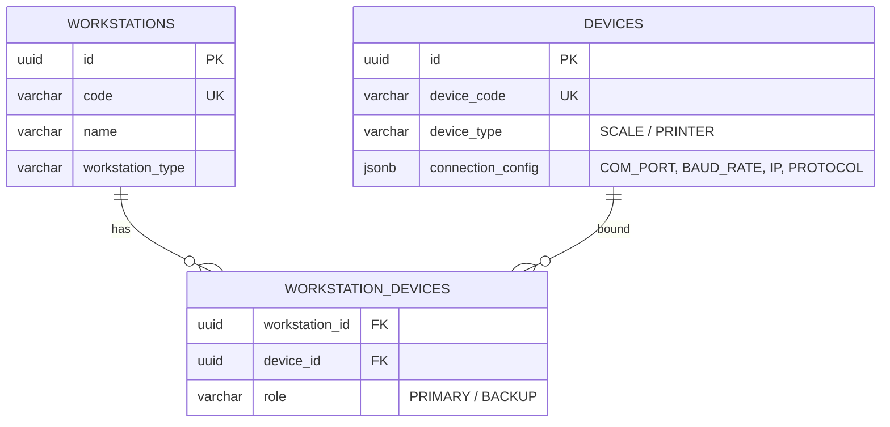

# Thiết kế cấu hình thiết bị cân và Máy in (printer-scale-device-binding.md)

Tài liệu này đặc tả cơ chế liên kết động (Dynamic Binding) các thiết bị phần cứng (Cân điện tử, Máy in tem) vào từng Máy trạm vận hành (`workstation_id`) thông qua cơ sở dữ liệu hệ thống, loại bỏ hoàn toàn việc gán cứng (hard-code) cổng COM, địa chỉ IP hay Driver trong mã nguồn.

---

## 1. Cấu trúc Thực thể liên kết Thiết bị (Entity Relationship Model)

Hệ thống quản lý thiết bị thông qua các bảng cấu hình động tại schema `app`:



### 1.1. Bảng cấu hình thiết bị (`app.devices`)
Trường `connection_config` lưu trữ dưới dạng JSONB chứa các tham số truyền thông của thiết bị vật lý:
- **Đối với Cân điện tử (SCALE):**
  ```json
  {
    "interface": "SERIAL",
    "com_port": "COM3",
    "baud_rate": 9600,
    "data_bits": 8,
    "parity": "NONE",
    "stop_bits": 1,
    "protocol": "METTLER_TOLEDO"
  }
  ```
- **Đối với Máy in tem (PRINTER):**
  ```json
  {
    "interface": "NETWORK",
    "ip_address": "192.168.1.150",
    "port": 9100,
    "protocol": "TSPL",
    "dpi": 203
  }
  ```

---

## 2. Quy trình phân giải thiết bị động (Device Resolution Flow)

Khi một Kiosk hoặc Local Agent khởi động, nó sẽ tự động phân giải cấu hình thiết bị của mình thông qua API Backend:

### 2.1. Phân giải Cân điện tử (Scale Resolution)
1.  **Handshake:** Trình duyệt Kiosk gửi Token nhận diện lên backend.
2.  **Resolve Device:** Backend truy vấn bảng `app.workstation_devices` để lấy thiết bị có vai trò `PRIMARY` và loại là `SCALE` gắn với máy trạm này.
3.  **Push Config to Agent:** Thông tin kết nối cổng COM và giao thức được đẩy xuống Local Agent cục bộ. Agent mở kết nối cổng Serial vật lý theo đúng cấu hình đó.

---

### 2.2. Phân giải Máy in & Cơ chế in dự phòng (Printer Failover)
Trạm in nhãn (`WS-PRINT-01`) hỗ trợ cơ chế máy in chính và máy in dự phòng (Failover) để tránh gián đoạn sản xuất:

- **Thiết lập:** 1 trạm có thể bind với 1 máy in chính (`PRIMARY`) và 1 máy in dự phòng (`BACKUP`).
- **Xử lý trạng thái không xác định (`PRINT_RESULT_UNKNOWN`):**
  *   Khi lệnh in được gửi xuống Agent, nếu Agent rớt kết nối hoặc không phản hồi trạng thái in thành công (ví dụ kẹt giấy, hết giấy, mất điện đột ngột), hệ thống **tuyệt đối không tự động kích hoạt in lại trên máy in dự phòng**.
  *   Trạng thái lệnh in được đánh dấu là `PRINT_RESULT_UNKNOWN` trên giao diện.
  *   **Hành vi bắt buộc:** Hệ thống hiển thị cảnh báo yêu cầu người vận hành xác nhận thủ công (đã in được tem hay chưa). Nếu chưa in được, người vận hành bấm nút "Thử lại trên máy in dự phòng" (Retry on Backup) kèm theo việc ghi nhận lý do kiểm toán (Audit Reason). Việc này ngăn chặn hoàn toàn việc in trùng tem phát vật tư ra xưởng.
