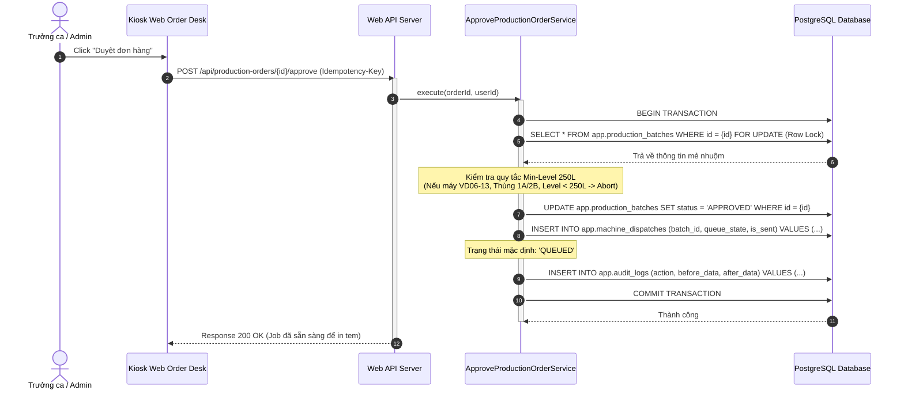

# Quy trình duyệt đơn hàng và Hàng đợi điều phối (production-order-to-dispatch-flow.md)

Tài liệu này đặc tả luồng chuyển đổi dữ liệu từ khâu lập Đơn sản xuất đến khâu duyệt và tạo Hàng đợi điều phối phục vụ in nhãn QR. Thiết kế này đối chiếu trực tiếp từ mã nguồn VBA của Workbook C3 và quy định các quy tắc nghiệp vụ/kỹ thuật tương đương trên hệ thống mới.

---

## 1. Phân tích luồng nghiệp vụ VBA gốc (Workbook C3)

### 1.1. Khởi tạo và Lưu đơn (`btnSAVE_Click`)
Trong Workbook `2.C3 grid load row lock id FB -192(QR).xlsm`, người vận hành nhập liệu thông qua các hộp điều khiển `Box1` (mã màu/color), `Box2` (mã hàng/code), `Box4` (máy nhuộm/machine), `Box5` (thùng/tank), `Box6` (mực nước/level).
Khi bấm **Save** (`btnSAVE_Click`):
1.  **Kiểm tra dữ liệu bắt buộc:** Phải điền đầy đủ thông tin màu, mã hàng, máy nhuộm.
2.  **Kiểm tra trùng lặp (Duplicate check):** Truy vấn kiểm tra nếu cặp `color` + `code` đã tồn tại trong bảng `tbl_input_all` (ngăn chặn lưu trùng).
3.  **Quy tắc Dung tích Tối thiểu (Minimum Level Rule 250L):**
    *   *Điều kiện áp dụng:* Nếu máy nhuộm thuộc dải máy legacy (`VD006` đến `VD013`) **VÀ** thùng phụ được chọn là `1A` hoặc `2B` **VÀ** mực nước nhập vào (`level`) nhỏ hơn `250` (Lít).
    *   *Hành vi:* Chặn không cho lưu đơn, hiển thị hộp thoại cảnh báo: `"MINIMUM LEVEL 250L"`.
4.  **Ghi dữ liệu tạm:** Gọi hàm `Insert_tbl_input_all` để thực hiện câu lệnh `INSERT INTO tbl_input_all` (database `RECORD_A`).
5.  **Duyệt và đẩy tự động:** Nếu ô `confirm2` (mã xác nhận lần 2) có giá trị là `"OK"` **VÀ** cột `tank` không rỗng, hệ thống sẽ tự động gọi procedure `MoveToSend(id)`.

### 1.2. Procedure di chuyển dữ liệu (`MoveToSend`)
Quy trình chuyển đổi hàng chờ duyệt (`tbl_input_all`) sang hàng đợi gửi (`tbl_tosend`) được thực hiện trong `Mod_movetosend.MoveToSend(id)` thông qua hai bước:
1.  **Bước 1:** Sao chép bản ghi đã duyệt từ `tbl_input_all` sang `tbl_tosend`:
    ```sql
    INSERT INTO tbl_tosend (color, code, machine, tank, level, scale_check, ...)
    SELECT color, code, machine, tank, level, 'NO', ...
    FROM tbl_input_all WHERE id = {target_id};
    ```
2.  **Bước 2:** Xóa bản ghi cũ khỏi bảng chờ duyệt `tbl_input_all`:
    ```sql
    DELETE FROM tbl_input_all WHERE id = {target_id};
    ```
*Nhược điểm của VBA:* Thao tác này chạy tuần tự thông qua kết nối ADODB/DAO thông thường mà không sử dụng cơ chế Transaction (`BeginTrans` / `CommitTrans`), dẫn đến rủi ro mất dữ liệu hoặc trùng lặp dữ liệu nếu xảy ra lỗi mạng ở bước 2 sau khi bước 1 đã hoàn thành.

---

## 2. Thiết kế luồng xử lý trên Hệ thống Web

Để loại bỏ các rủi ro về tính toàn vẹn dữ liệu và đảm bảo khả năng mở rộng, hệ thống Web sẽ thay thế hoàn toàn cơ chế di chuyển bảng vật lý bằng cơ chế **State Machine trên một thực thể thống nhất** kết hợp với **Application Services** và **Database Transactions**.

### 2.1. Kiến trúc Service nghiệp vụ

Thay vì viết logic truy vấn SQL trực tiếp trong các HTTP Controller, hệ thống triển khai hai Application Service chuyên biệt:

#### 1. `ApproveProductionOrderService`
Chịu trách nhiệm thực hiện nghiệp vụ kiểm tra điều kiện duyệt mẻ sản xuất:
- **Kiểm tra Min-Level 250L:** Áp dụng logic kiểm tra nếu máy nhuộm thuộc `{VD006..VD013}` và thùng phụ là `1A`/`2B`, mực nước phải đạt $\ge 250L$.
- **Kiểm tra trùng lặp đơn:** Đảm bảo không tạo mẻ trùng mã màu và mã hàng trong cùng một phiên vận hành.
- **Transaction & Lock:** Thực hiện khóa dòng (Row-level Lock bằng `SELECT FOR UPDATE` hoặc Optimistic Locking qua cột `row_version`) trên thực thể `ProductionBatch` để tránh xung đột dữ liệu khi hai người dùng cùng thao tác duyệt một mẻ.

#### 2. `CreateDispatchJobService`
Đóng vai trò thay thế cho procedure `MoveToSend` cũ:
- **Idempotency Key:** Sinh khóa trùng lặp dựa trên mã đơn hàng (`batch_id`) dạng `dispatch-{batch_id}`. Đảm bảo nếu API bị gọi lại nhiều lần do mạng chập chờn, hệ thống chỉ tạo duy nhất 1 công việc điều phối (`DispatchJob` / `app.machine_dispatches`).
- **Ghi nhật ký Audit Event:** Tự động tạo bản ghi kiểm toán `ORDER_DISPATCHED` kèm theo `correlation_id` và mã người dùng thao tác.

### 2.2. Sơ đồ tuần tự giao dịch (Sequence Diagram)



---

## 3. Khử cơ chế Move-Pattern (Move và Delete vật lý)
*   **Hệ thống cũ:** Di chuyển bản ghi từ `tbl_input_all` sang `tbl_tosend` và xóa bản ghi gốc.
*   **Hệ thống mới:** Bản ghi mẻ sản xuất được lưu cố định tại bảng `app.production_batches`. Khi được duyệt, hệ thống chỉ cập nhật trường `status` của mẻ thành `APPROVED` và tạo bản ghi điều phối liên kết trong bảng `app.machine_dispatches` với trường trạng thái `queue_state` là `QUEUED` (tương đương nằm trong `tbl_tosend` chờ in nhãn). Mẻ sản xuất gốc tuyệt đối không bị xóa.
*   Trạm in tem (`QR_LABEL_PRINTING`) chỉ truy vấn các bản ghi điều phối có trạng thái `queue_state = 'QUEUED'`.
