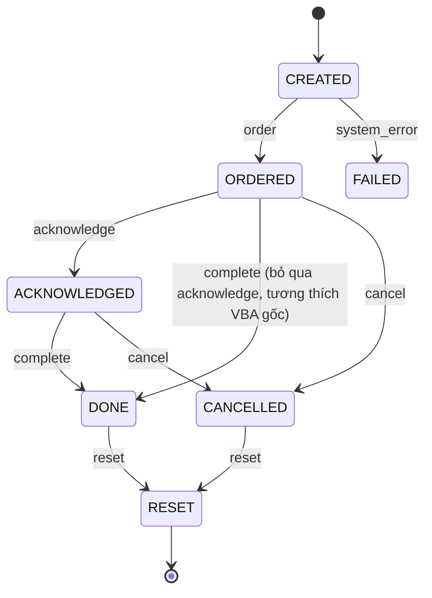
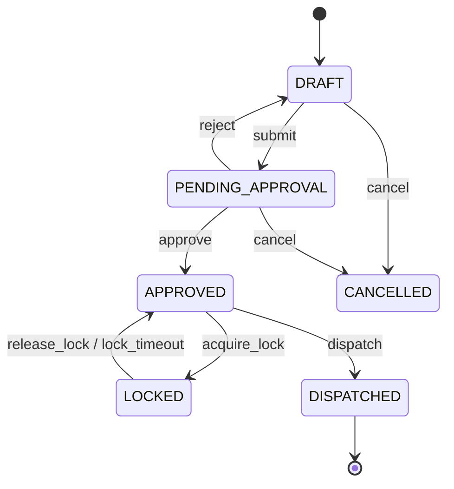
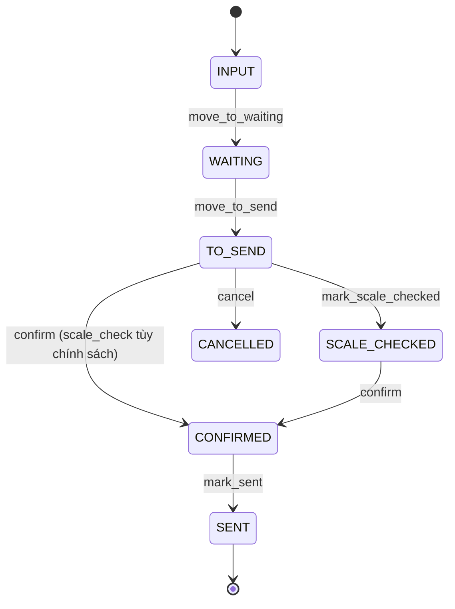
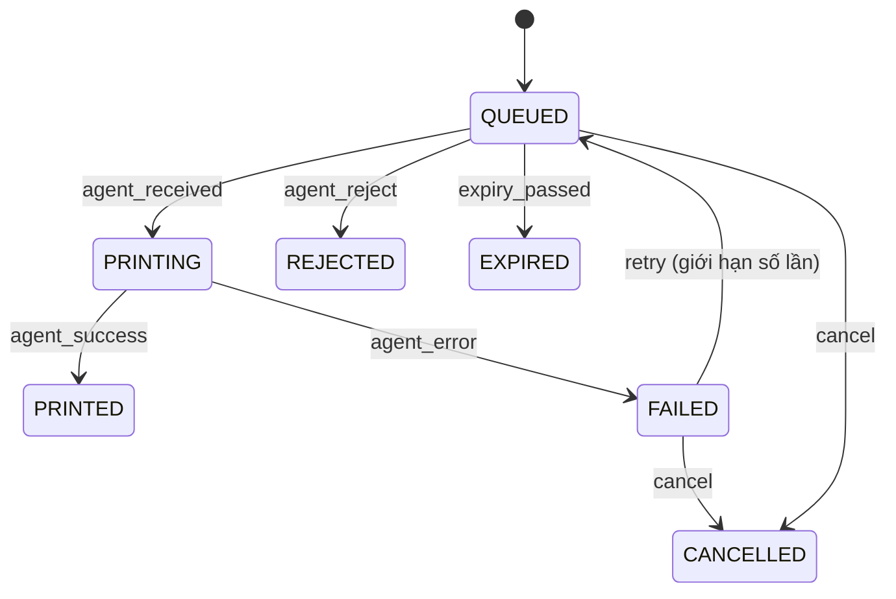
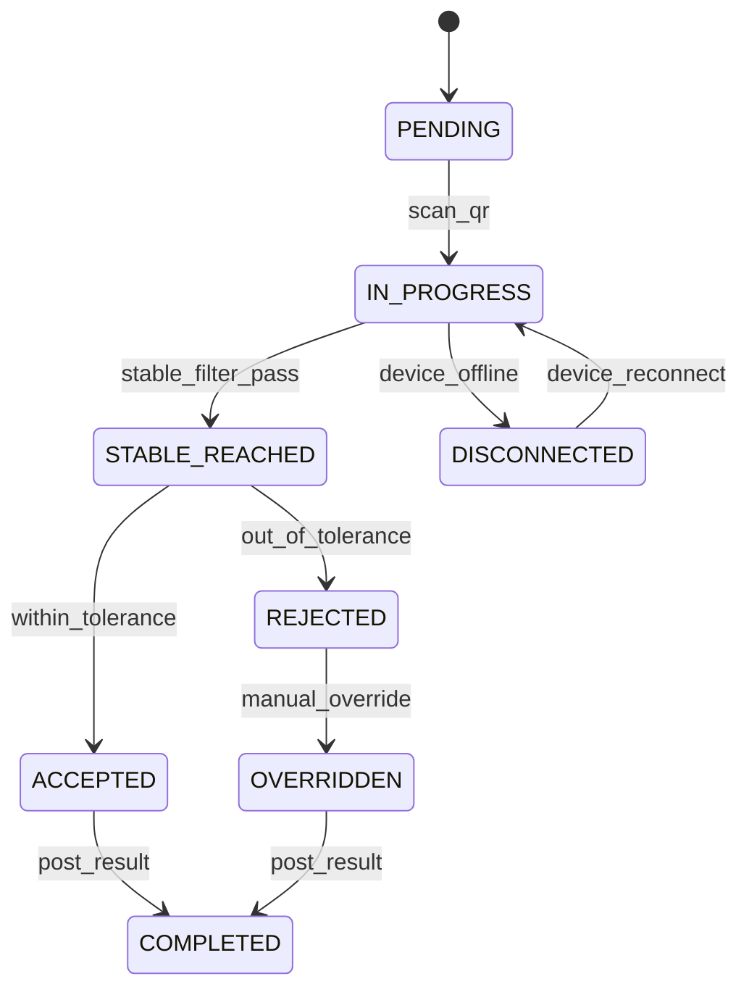
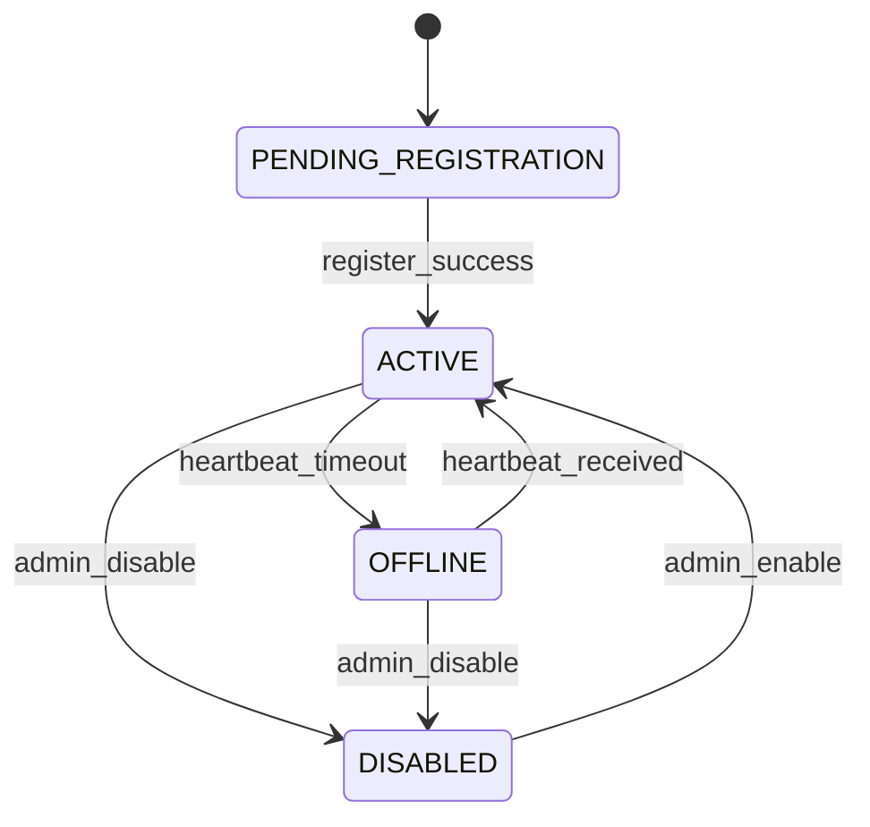

# State Machines (state-machines.md)

Lập 2026-07-17 — Phase C. 6 state machine theo yêu cầu mục 16. Mỗi bảng transition đúng format `| From | Event | To | Actor | Preconditions | Side effects | Audit event | Idempotency |`.

---

## 1. Chemical Call Request

> **Giải thích trạng thái so với VBA gốc:** VBA chỉ có 2 giá trị `Status` (0=DONE/1=ORDER). `CREATED` là trạng thái KỸ THUẬT (bản ghi vừa tạo trước khi ghi nhận ORDER thật — cho phép validate trước khi commit), không phải nghiệp vụ mới. `ACKNOWLEDGED` là trạng thái NGHIỆP VỤ MỚI (chưa có trong VBA) — đề xuất tùy chọn (không bắt buộc dùng, có thể bỏ qua đi thẳng `ORDERED→DONE` để khớp đúng VBA). `CANCELLED`/`FAILED`/`RESET` đều là bổ sung mới, cần CH-BUS xác nhận trước khi bật (mặc định feature-flag tắt hành vi hủy/reset, chỉ bật ORDER/DONE để khớp đúng gốc — xem `feature-flags.md`).

| From | Event | To | Actor | Preconditions | Side effects | Audit event | Idempotency |
|---|---|---|---|---|---|---|---|
| *(none)* | `create` | CREATED | Operator (CHEMICAL_CALL workstation) | Channel tồn tại và `is_active=true` | Tạo bản ghi, sinh `idempotency_key` | `CHEMICAL_CALL_CREATED` | Key theo `(channel_id, client_request_id)` |
| CREATED | `order` | ORDERED | Operator | Không có request khác đang mở cho cùng channel (`uq_channel_active_order`) | Ghi `requested_at`, phát `chemical_call.status_changed` | `CHEMICAL_CALL_ORDERED` | Nếu request đã ORDERED, trả 200 idempotent (không tạo mới) |
| ORDERED | `acknowledge` | ACKNOWLEDGED | Operator xưởng hóa chất (tùy chọn, feature-flag) | request đang ORDERED | Ghi `acknowledged_at` | `CHEMICAL_CALL_ACKNOWLEDGED` | Gọi lại khi đã ACKNOWLEDGED → no-op 200 |
| ORDERED hoặc ACKNOWLEDGED | `complete` | DONE | Operator | request đang mở | Ghi `confirmed_at`, giải phóng unique constraint | `CHEMICAL_CALL_DONE` | Gọi lại khi đã DONE → no-op 200 |
| ORDERED/ACKNOWLEDGED | `cancel` | CANCELLED | Operator/Admin (feature-flag) | request đang mở | Ghi `cancelled_at`+`cancelled_reason` | `CHEMICAL_CALL_CANCELLED` | Idempotent |
| CREATED | `system_error` | FAILED | Hệ thống | Lỗi ghi DB/kết nối | Log lỗi, KHÔNG retry tự động vô hạn | `CHEMICAL_CALL_FAILED` | — |
| DONE/CANCELLED | `reset` | RESET→(xóa/archive) | Admin only (feature-flag, mặc định TẮT) | Có quyền `chemical_call.reset` | Audit override rõ ràng | `CHEMICAL_CALL_RESET` | — |

---

## 2. Production Order

| From | Event | To | Actor | Preconditions | Side effects | Audit event | Idempotency |
|---|---|---|---|---|---|---|---|
| *(none)* | `create` | DRAFT | Operator (PRODUCTION_ORDER) | color+code không trùng đơn đang mở (`DuplicateColorCodePolicy`) | Tạo `production_batches` | `ORDER_CREATED` | Client request id |
| DRAFT | `submit` | PENDING_APPROVAL | Operator | Đủ trường bắt buộc (machine/tank/level) | — | `ORDER_SUBMITTED` | — |
| PENDING_APPROVAL | `approve` | APPROVED | Trưởng ca/QA | Qua `MinimumCapacityPolicy` (250L, chờ CH-BUS-005) | Ghi `production_order_status_events` | `ORDER_APPROVED` | — |
| PENDING_APPROVAL | `reject` | DRAFT | Trưởng ca/QA | — | Ghi lý do từ chối | `ORDER_REJECTED` | — |
| APPROVED | `acquire_lock` | LOCKED | Operator (bất kỳ workstation) | `lock_owner_user_id IS NULL` hoặc `lock_expires_at < now()` | Ghi `lock_owner_user_id`, `lock_acquired_at`, `lock_expires_at = now()+N phút` | `ORDER_LOCKED` | Trả lỗi 409 nếu đã bị khóa bởi người khác còn hạn |
| LOCKED | `release_lock` | APPROVED | Chủ khóa hoặc hệ thống (timeout) | — | Xóa `lock_owner_user_id` | `ORDER_LOCK_RELEASED` | — |
| LOCKED (người khác) | `force_release` | APPROVED | Admin | Quyền `lock.override` | Ghi rõ ai override, lý do | `ORDER_LOCK_OVERRIDDEN` | — |
| APPROVED | `dispatch` | DISPATCHED | Operator | Không đang LOCKED bởi người khác | Tạo `machine_dispatches` tương ứng (1 transaction), phát `production_order.dispatched` | `ORDER_DISPATCHED` | Nếu đã có `machine_dispatches` liên kết → idempotent, không tạo trùng |
| DRAFT/PENDING_APPROVAL | `cancel` | CANCELLED | Operator/Trưởng ca | — | Soft delete | `ORDER_CANCELLED` | — |

---

## 3. Dispatch Job (ConfirmRow tương đương)

| From | Event | To | Actor | Preconditions | Side effects | Audit event | Idempotency |
|---|---|---|---|---|---|---|---|
| *(Production Order)* | `move_to_waiting` | INPUT→WAITING | Hệ thống (theo `production_order.dispatched`) | — | Ghi vào `machine_dispatches.queue_state` | `DISPATCH_QUEUED` | — |
| WAITING | `move_to_send` | TO_SEND | Operator (QR_LABEL_PRINTING) | — | — | `DISPATCH_MOVED_TO_SEND` | — |
| TO_SEND | `mark_scale_checked` | SCALE_CHECKED | Operator hoặc tự động khi in (tùy `ScaleCheckPolicy`) | — | Set `scale_checked=true` | `SCALE_CHECK_UPDATED` | Idempotent (set lại = no-op) |
| TO_SEND/SCALE_CHECKED | `confirm` | CONFIRMED | Operator (bấm OK) | Bản ghi còn tồn tại (chưa bị confirm trước đó — kiểm tra bằng `idempotency_key`) | **13 bước `ConfirmDispatchService`** (Mục dưới) trong 1 transaction | `DISPATCH_CONFIRMED` | **Bắt buộc** — gọi lại cùng `idempotency_key` trả kết quả cũ, KHÔNG tạo `dispatch_events`/`qr_payloads` lần 2 |
| CONFIRMED | `mark_sent` | SENT | Hệ thống/Operator | — | Set `is_sent=true`, `sent_at` | `DISPATCH_SENT` | Idempotent |
| TO_SEND | `cancel` | CANCELLED | Operator/Trưởng ca | — | — | `DISPATCH_CANCELLED` | — |

### Chi tiết `ConfirmDispatchService::confirm()` — 13 bước trong 1 transaction (đúng mục 7.3 yêu cầu)

1. Kiểm tra bản ghi còn hợp lệ (tồn tại, chưa bị xóa).
2. Kiểm tra chưa confirm (tra `idempotency_key` — nếu đã có, trả kết quả cũ, dừng ở đây, KHÔNG chạy tiếp bước 3-12).
3. Khóa dòng (`SELECT ... FOR UPDATE`) hoặc kiểm tra `row_version`.
4. Gọi `WarehouseRoutingService` tính B24 → tạo `routing_decisions` (mode theo feature flag, mặc định `MANUAL_REVIEW` cho case chưa rõ).
5. Gọi `QrPayloadService` tạo `qr_payloads` (dye/chem/+process|extra|fb theo mode).
6. Gọi `PrintJobService` tạo `print_jobs` (status=`queued`).
7. Cập nhật `machine_dispatches.queue_state='CONFIRMED'`.
8. Lưu `raw_qr_dye` vào `dispatch_events`.
9. Lưu `raw_qr_chemical` vào `dispatch_events`.
10. Cập nhật `scale_checked` theo `ScaleCheckPolicy` (chỉ nếu luồng `wait_printform`-tương đương, KHÔNG tự động cho luồng `printform`-tương đương — đúng khác biệt đã audit).
11. Ghi `AUDIT_LOG` (`DISPATCH_CONFIRMED`).
12. Phát integration event `dispatch.confirmed`.
13. Commit transaction — trả response idempotent-safe (kèm `idempotency_key` để client dùng lại nếu cần).

**Nếu bước 4-12 lỗi ở bất kỳ đâu → toàn bộ rollback, KHÔNG ghi 1 phần** (khác VBA gốc: `INSERT tbl_SentLog` + `DELETE tbl_tosend` là 2 lệnh rời rạc, không transaction — đây là điểm cải tiến bắt buộc, không phải giữ nguyên bug).

---

## 4. Print Job

| From | Event | To | Actor | Preconditions | Side effects | Audit event | Idempotency |
|---|---|---|---|---|---|---|---|
| *(Dispatch confirm)* | `create` | QUEUED | Backend (bước 6 ở trên) | — | Sinh `idempotency_key`, `expiry` | `PRINT_JOB_CREATED` | Key = `dispatch_id + payload_hash` |
| QUEUED | `agent_received` | PRINTING | Print Agent | Agent xác thực hợp lệ (Mục bảo mật `local-agent-architecture.md`) | Ghi `print_attempts` mới | `PRINT_JOB_RECEIVED` | Attempt sequence tăng dần |
| PRINTING | `agent_success` | PRINTED | Print Agent | — | Ghi kết quả in, đóng `print_attempts` | `PRINT_JOB_PRINTED` | — |
| PRINTING | `agent_error` | FAILED | Print Agent | — | Ghi `error_detail` | `PRINT_JOB_FAILED` | — |
| FAILED | `retry` | QUEUED | Hệ thống (tự động, có giới hạn) hoặc Operator | `attempt_no < max_retry` | Tăng `attempt_no` | `PRINT_JOB_RETRIED` | KHÔNG tạo `dispatch_events`/`qr_payloads` mới — chỉ tạo `print_attempts` mới |
| QUEUED | `expiry_passed` | EXPIRED | Hệ thống (cron) | `now() > expiry` | — | `PRINT_JOB_EXPIRED` | — |
| QUEUED/FAILED | `cancel` | CANCELLED | Operator (quyền `print.cancel`) | — | — | `PRINT_JOB_CANCELLED` | — |

---

## 5. Weighing Job

| From | Event | To | Actor | Preconditions | Side effects | Audit event | Idempotency |
|---|---|---|---|---|---|---|---|
| *(Dispatch/PrintJob printed)* | `create` | PENDING | Hệ thống | — | Tạo `weighing_jobs`/`weighing_job_items` | `WEIGH_JOB_CREATED` | — |
| PENDING | `scan_qr` | IN_PROGRESS | Operator (SMALL_SCALE/LARGE_SCALE) | QR hợp lệ, chưa xử lý (chống scan 2 lần — Mục 24 test) | Bắt đầu nhận `weighing_samples` | `WEIGH_STARTED` | Scan lần 2 cùng job → trả lại job hiện tại, KHÔNG tạo job mới |
| IN_PROGRESS | `stable_filter_pass` | STABLE_REACHED | Agent/Backend (`StableFilterPolicy`) | Đủ `min_sample_count`, delta < `max_delta` trong `sample_window` | Ghi `weighing_samples.is_stable=true` | `WEIGH_STABLE_REACHED` | — |
| STABLE_REACHED | `within_tolerance` | ACCEPTED | Hệ thống (`ToleranceCheckPolicy`) | Giá trị trong dải tolerance | Tạo `weighing_results` | `WEIGH_ACCEPTED` | — |
| STABLE_REACHED | `out_of_tolerance` | REJECTED | Hệ thống | Ngoài dải tolerance | Tạo `weighing_results` (tolerance_status=REJECTED) | `WEIGH_REJECTED` | — |
| REJECTED | `manual_override` | OVERRIDDEN | Trưởng ca/QA (quyền `weighing.override_tolerance`) | Có lý do override | `is_override=true`, `override_reason`, **KHÔNG ghi đè raw sample** | `WEIGH_OVERRIDDEN` | — |
| ACCEPTED/OVERRIDDEN | `post_result` | COMPLETED | Operator | — | Ghi `posted_at`, phát `weighing.completed` | `WEIGH_COMPLETED` | Idempotent theo `job_item_id` |
| IN_PROGRESS | `device_offline` | DISCONNECTED | Agent (heartbeat timeout) | — | Buffer local, không mất sample | `DEVICE_OFFLINE` | — |
| DISCONNECTED | `device_reconnect` | IN_PROGRESS | Agent | Có mạng lại | Đồng bộ buffer, chống trùng bằng `sequence_no` | `DEVICE_RECONNECTED` | `UNIQUE(device_id, sequence_no)` chặn trùng |

---

## 6. Device Connectivity

| From | Event | To | Actor | Preconditions | Side effects | Audit event | Idempotency |
|---|---|---|---|---|---|---|---|
| *(none)* | `register` | PENDING_REGISTRATION | Admin (cấp token 1 lần) | — | Sinh `registration_token` | `DEVICE_REGISTRATION_STARTED` | — |
| PENDING_REGISTRATION | `register_success` | ACTIVE | Local Agent | Token hợp lệ + fingerprint gửi kèm | Đổi token thành credential dài hạn | `DEVICE_REGISTERED` | — |
| ACTIVE | `heartbeat_timeout` | OFFLINE | Hệ thống (cron, không nhận heartbeat > N giây) | — | Cảnh báo Realtime Dashboard | `DEVICE_HEARTBEAT_TIMEOUT` | — |
| OFFLINE | `heartbeat_received` | ACTIVE | Local Agent | — | Cập nhật `last_heartbeat_at` | `DEVICE_RECONNECTED` | — |
| ACTIVE/OFFLINE | `admin_disable` | DISABLED | Admin | Quyền `device.administration` | Từ chối mọi request từ device này | `DEVICE_DISABLED` | — |
| DISABLED | `admin_enable` | ACTIVE | Admin | — | — | `DEVICE_ENABLED` | — |
