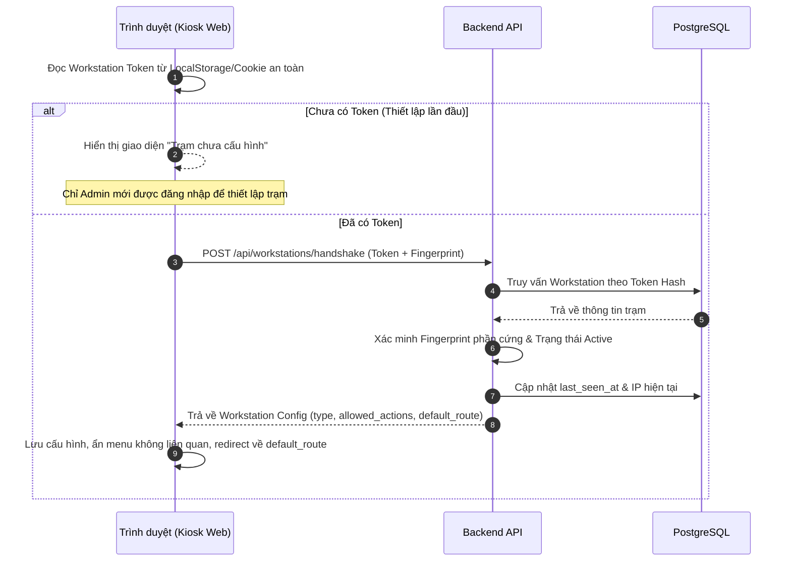
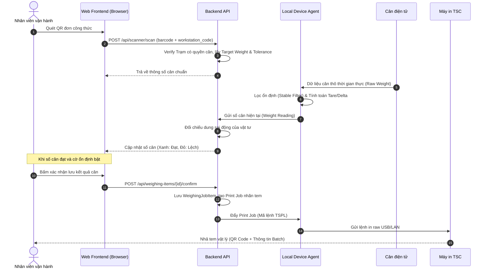

# System Context - Ngữ cảnh Hệ thống DF

Tài liệu này mô tả kiến trúc ngữ cảnh, các tác nhân bên ngoài, thiết bị phần cứng, danh sách máy trạm vận hành thực tế và luồng dữ liệu chính của hệ thống mới (TO-BE) so sánh với hệ thống cũ (AS-IS).

> [!IMPORTANT]
> **Cập nhật 2026-07-17:** Mục 3 (trước đây "7 Máy trạm thực tế") đã được viết lại theo cơ cấu vận hành thật đã xác nhận với người dùng: **6 máy nghiệp vụ / 5 workstation type**, ánh xạ trực tiếp 5 workbook VBA nguồn. Danh sách 7 IP trước đây chỉ dựa trên lịch sử kết nối mạng, không có xác nhận vai trò — nay giữ làm phụ lục tham chiếu, không dùng để khẳng định workstation. Chi tiết đầy đủ và bảng đối chiếu xem `workstation-matrix.md`.
>
> **Cập nhật 2026-07-17 (đợt duyệt lần 4):** Đã hoàn tất database discovery (`database-inventory.md`) xác nhận RECORD_A (`RECORD.accdb`, dispatch/sổ gửi hàng) và RECORD_B (`RECORD1.accdb`, dữ liệu cân) là 2 hệ độc lập — xem `legacy-database-mapping.md` cho bản đồ đầy đủ Workstation→Workbook→Database→Bảng.

---

## 1. Bản đồ Tương tác Hệ thống (System Context Diagram)

```mermaid
graph TB
    subgraph Môi trường Web Server (Cầu nối Trung gian)
        WebUI[Web Frontend - Vue 3 Single-Screen Kiosk] <--> API[Backend API - Laravel]
        API <--> DB[(PostgreSQL 15+)]
    end

    subgraph Hệ thống Nguồn
        MES[Hệ thống MES Nhà máy] -->|Thông tin Màu sắc & Sản phẩm| API
    end

    subgraph Trạm làm việc tại Nhà xưởng (6 Máy nghiệp vụ / 5 Workstation type)
        Agent[Local Device Agent - Windows Service] <--> API
        Scale[Cân điện tử] -->|Cổng Serial COM/USB| Agent
        Agent -->|Lệnh in TSPL động| Printer[Máy in Tem TSC USB/LAN]
    end

    subgraph Hệ thống Nhuộm & Dosing tự động (Hạ nguồn)
        DosingApp[Hệ pha màu/Cấp hóa chất tự động] <-->|tbl_status / API| DB
        ExternalApp[Ứng dụng Máy nhuộm / Adapter] <-->|File/Protocol| Agent
    end

    Operator[Nhân viên vận hành - Bị khóa theo công đoạn] <-->|Chỉ quét QR, không nhập tự do| WebUI
    Admin[Quản trị viên] <-->|Thiết lập & Khóa trạm| WebUI
```

---

## 2. Mô tả các Thành phần và Thiết bị tích hợp

### 2.1. Lớp Ứng dụng Web tập trung
- **Web Frontend (Vue 3 + Vite):** Chạy ở chế độ Kiosk toàn màn hình trên các máy trạm nhà xưởng. Giao diện tối giản, tập trung vào nhiệm vụ quét mã QR (Scan-first UI), phóng to kích thước chữ/nút. Đối với các tài khoản trạm làm việc bị khóa bởi Admin, sidebar điều hướng bị ẩn hoàn toàn và router tự động chuyển hướng và giữ Operator tại màn hình vận hành duy nhất.
- **Backend API (Laravel):** Thực hiện xác thực token đăng ký trạm (`registration_token_hash`), kiểm tra ràng buộc vai trò của người dùng kết hợp với loại trạm hoạt động (`workstation_type`), tính toán công thức, so khớp dung sai cân, sinh nhãn QR và ghi audit log bất biến.
- **PostgreSQL 15+:** Lưu trữ các bảng chuẩn hóa bao gồm cấu hình trạm, danh mục thiết bị được gán, lịch sử mạng và vết kiểm toán.

### 2.2. Lớp Tích hợp Thiết bị Cục bộ (Local Station)
- **Local Device Agent (.NET Service):** Chạy ngầm trên các máy tính trạm nhà xưởng, sử dụng API token để giao tiếp an toàn với Backend.
  - **Đọc cân:** Đọc cổng Serial (RS232) của cân, áp dụng Stable Filter và Tare/Delta-calculation động trước khi gửi số cân sạch lên Backend API.
  - **In nhãn TSC:** Nhận mã lệnh in thô TSPL từ Backend và spool thẳng xuống máy in TSC qua USB hoặc cổng mạng LAN port 9100.
  - **Nhận diện thiết bị an toàn:** Gửi kèm vân tay phần cứng (Device Fingerprint) cùng với token để Backend đối chiếu xác thực, không dựa vào IP mạng.

---

## 3. Danh sách 6 Máy Nghiệp vụ Thực tế (Client Workstations) — CẬP NHẬT 2026-07-17

Người dùng đã xác nhận trực tiếp cơ cấu vận hành thật gồm **6 máy nghiệp vụ cố định**, ánh xạ 1-1 với 5 workbook VBA nguồn (SMALL_SCALE dùng chung 1 profile cho 2 máy). Chi tiết đầy đủ, bảng đối chiếu Workstation↔Workbook↔UserForm↔API, và cảnh báo về các khoảng trống audit mới phát hiện nằm ở [`workstation-matrix.md`](file:///F:/DF/.claude/workstation-matrix.md).

1. **CHEMICAL_CALL (1 máy):** Gọi hóa chất / thông báo phát hóa chất tới xưởng. Nguồn: `1.báo phát AC XƯỞNG -193.xlsm`. **Chưa có bất kỳ Controller/route/view nào trên web** (xác nhận qua audit 2026-07-17: 43/44 procedure ở trạng thái MISSING).
2. **PRODUCTION_ORDER (1 máy):** Báo đơn sản xuất qua QR / điều phối hàng chờ. Nguồn: `2.C3 grid load row lock id FB -192(QR).xlsm`. Đã có `MachineQueue.vue`/`MachineDispatchController` — còn thiếu 1 số endpoint (xem `legacy-to-target-architecture.md` Bước 2).
3. **QR_LABEL_PRINTING (1 máy):** In tem QR sau khi nhận đơn sản xuất. Nguồn: `3.DF028 ... jit qr sending - 15l special.xlsm`. **Đang audit lại** — audit PRINT trước đây (83 dòng `VBA-PRINT-*`) thực chất dựa trên 2 workbook khác không phải máy sản xuất thật.
4. **SMALL_SCALE (2 máy, dùng chung 1 profile):** Cân thủ công cho lượng màu nhỏ. Nguồn: `4.semiauto-small scale - delta-stable-final_DF026-027.xlsm`.
5. **LARGE_SCALE (1 máy):** Hỗ trợ cân khối lượng lớn. Nguồn: `5.Semiauto- lockmove SEND OVER6 - delta-stable-final-221.xlsm`.

Binding IP thật của từng máy trong 6 máy trên vẫn ở trạng thái `TO_CONFIRM` — xem bảng đối chiếu 7 IP lịch sử mạng (Mục 4 dưới đây) và `workstation-matrix.md` Mục 4 để biết chi tiết chênh lệch số lượng (7 IP lịch sử vs 6 máy xác nhận).

**Các "workstation" KHÔNG nằm trong 6 máy đã xác nhận, không tự gán vai trò shop-floor cố định:** RECIPE (Công thức/TraHeSo), TROUBLESHOOTING (Chẩn đoán sự cố), và 3 mục viết mới Bước 6/7/8 cũ (Vận chuyển `WS-TRANS-01`, Tới thùng `WS-TANK-01`, Cấp máy `WS-FEED-01`) — xem `workstation-matrix.md` Mục 5 và `open-questions.md` CH-BUS-010.

### Phụ lục — 7 IP lịch sử kết nối mạng (dữ liệu cũ, CHƯA đối chiếu xong với 6 máy trên)

1. 192.168.250.192 — gán trước đây "ORDER_SCAN" (giả định, chưa xác nhận).
2. 10.0.3.95 — gán trước đây "ORDER_SCAN" (giả định, chưa xác nhận).
3. 192.168.250.196 — gán trước đây "ORDER_SCAN" (giả định, chưa xác nhận).
4. 10.0.19.74 — gán trước đây "WEIGH, `TO_CONFIRM`".
5. 10.0.19.171 — gán trước đây "WEIGH, `TO_CONFIRM`".
6. 192.168.100.221 — gán trước đây "WEIGH, `TO_CONFIRM`".
7. 10.0.19.79 — gán trước đây "LABEL_PRINTING".

Không có IP lịch sử nào từng được gán riêng cho CHEMICAL_CALL — xem giả thuyết và câu hỏi mở trong `workstation-matrix.md` Mục 4.

---

## 4. Luồng dữ liệu chính (Data Flows)

### 4.1. Khởi động và Xác thực Trạm (Workstation Handshake Flow)


### 4.2. Luồng Cân liệu và In tem (Weighing & Printing Flow)

