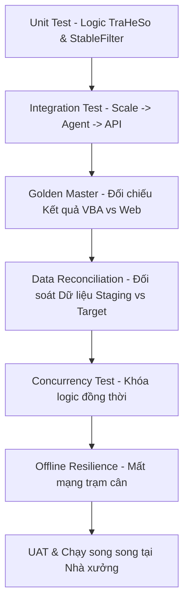

# Testing Strategy - Chiến lược Kiểm thử

Tài liệu này đặc tả quy trình kiểm thử chất lượng dữ liệu di trú, logic tính toán công nghệ, và khả năng tích hợp thiết bị cục bộ của hệ thống DF.

---

## 1. Bản đồ Chiến lược Kiểm thử (Testing Map)

---

## 2. Các Phân hệ Kiểm thử Chi tiết

### 2.1. Kiểm thử Logic lõi (Unit Test)
- **Kiểm thử TraHeSo:** Viết các unit test độc lập cho Calculation Service của Backend để tra hệ số, tính mực nước, lực căng từ các cấu hình tham số. Đầu vào là mã hàng, mã màu và khối lượng vải thực tế.
- **Kiểm thử Stable Filter (Bộ lọc ổn định số cân):** Viết các test case đầu vào giả lập chuỗi thô từ cân (chứa số nhảy liên tục, số âm, ký hiệu đặc biệt) và kiểm tra hàm lọc của Agent có trả ra đúng số cân thực tế và cờ ổn định (stability flag) hay không.

### 2.2. Kiểm thử Đối chiếu Excel VBA (Golden Master Test)
- **Mục tiêu:** Chứng minh logic tính toán trên ứng dụng Web cho ra kết quả trùng khớp 100% với file Excel Macro cũ.
- **Cách thực hiện:** 
  1. Trích xuất một tập dữ liệu thử nghiệm (Golden Dataset) gồm 50 mẻ nhuộm thực tế có chứa đầy đủ các thông số đầu vào và kết quả đầu ra tính toán từ Excel VBA cũ.
  2. Nạp tập dữ liệu đầu vào này vào API Backend Web.
  3. So sánh tự động kết quả tính toán định lượng bột màu và mực nước đầu ra. Sai số cho phép đối với định mức cân bột màu là `0.0`.

### 2.3. Kiểm thử Đối soát Di trú Dữ liệu (Migration Reconciliation)
- Sử dụng tệp `04_validation_queries.sql` để thực hiện đối soát số lượng bản ghi:
  - Số dòng `tblRECORD` nguồn trong Access phải bằng số dòng `scale_measurements` (loại DYE) trong PostgreSQL.
  - Số dòng `tblRECORD_chem` nguồn trong Access phải bằng số dòng `scale_measurements` (loại CHEMICAL) trong PostgreSQL.
  - Đối soát tổng trọng lượng bột màu tích lũy (SUM weight) của từng mã lô nhuộm giữa Access và PostgreSQL. Sai số cho phép là `0.000001` (để bù trừ sai lệch làm tròn kiểu float của Access sang numeric của Postgres).
  - Quét tìm các bản ghi mồ côi (Orphan Record) trong `machine_dispatches` và báo cáo tỉ lệ khớp mã lô.

### 2.4. Giả lập Thiết bị Phần cứng (Scale & Print Simulators)
- Vì môi trường phát triển (Dev Environment) không có sẵn cân điện tử thật và máy in TSC TE200, đội phát triển phải xây dựng hai bộ giả lập trong thư mục `scratch/`:
  - **Scale Simulator:** Một tập lệnh Python phát dữ liệu thô giả lập cổng Serial COM ảo (Virtual COM Port) liên tục để Agent đọc và kiểm thử.
  - **Print Simulator:** Một ứng dụng nhỏ lắng nghe cổng mạng in RAW, nhận mã lệnh TSPL in từ Backend và xuất ra tệp ảnh PNG hiển thị tem in ảo để lập trình viên kiểm tra bố cục nhãn in.
- **[Xác minh 2026-07-16]:** thư mục `F:\DF\scratch\` **chưa tồn tại** — 2 bộ giả lập trên mới ở mức kế hoạch, chưa triển khai. Cơ chế giả lập cân thực tế hiện dùng là `Agent:Scale:UseSimulation=true` + đọc file tĩnh `F:\DF\agent\putty_log.txt` (`ScaleReader.cs`), không phải Virtual COM Port động như mô tả — đơn giản hơn nhưng đủ dùng cho dev hiện tại. Cần làm rõ có còn cần 2 simulator đầy đủ như thiết kế hay giữ nguyên cách tiếp cận file tĩnh.

### 2.8. Golden Test bổ sung từ đợt rà soát VBA→Web (2026-07-16)
Đợt rà soát 378-dòng đối chiếu VBA↔Web (xem [vba-migration-matrix.md](file:///F:/DF/.claude/vba-migration-matrix.md)) phát hiện lõi thuật toán cân bán tự động **chưa có golden test** vì bản thân logic tương đương còn thiếu ở hệ mới (xem `risks-and-assumptions.md` mục R-09). Đề xuất 3 bộ golden test cụ thể (input/expected output đầy đủ có trong `vba-migration-matrix.md` nhóm SCALE, mục XI) cần viết **trước khi** coi thuật toán cân là đã migrate:

1. **`StableFilter`** (VBA-SCALE-022/112/120): ổn định = 2 lần đọc liên tiếp **giống hệt về chuỗi ký tự** (không phải số có dung sai) — input mẫu `["12.30","12.34","12.34","12.35","12.35","12.35"]` → expected `["","","12.34","12.34","12.35","12.35"]`. Test case bắt buộc: `"12.30"` vs `"12.3"` KHÔNG được coi là ổn định (so sánh string, không phải numeric).
2. **`ExtractLastNumber`/`CleanScaleRaw`** (VBA-SCALE-021 vs `.NET ScaleReader.CleanWeight`): input phân kỳ `"12,ST,GS,+000010.5g"` — VBA lấy token số **cuối cùng** (`"+000010.5"`), Regex `.NET` hiện tại lấy match **đầu tiên** (`"12"`, SAI). Đây là test case then chốt lộ ra khác biệt thuật toán thật giữa VBA và `ScaleReader.cs`.
3. **`AutoFlow_OnWeight`** (delta/tare theo slot, VBA-SCALE-118/119/121): chuỗi 3 lần đọc gross → xác nhận rule "lần đọc đầu = tare/baseline, các lần sau = actual - tare". Cần làm rõ trước (xem `open-questions.md` CH-BUS-006) hệ mới có tự trừ bì hay yêu cầu client gửi giá trị đã trừ sẵn — golden test phải khớp với quyết định nghiệp vụ đó.

**Lưu ý về Golden Master `TraHeSo`:** mục 2.2 ở trên giả định hàm `TraHeSo` đã có trong `FormulaCalculationService` — đợt rà soát 2026-07-16 xác nhận **điều này KHÔNG đúng** (xem `open-questions.md` CH-BUS-004, `source-traceability.md`). Không thể chạy Golden Master 50-mẻ cho `TraHeSo` cho tới khi nghiệp vụ xác nhận có cần khôi phục hàm này hay không.

### 2.5. Kiểm thử Đồng thời (Concurrency Locking Test)
- Giả lập kịch bản 2 người vận hành tại 2 máy trạm khác nhau cùng bấm nút "Nhận xử lý" (Claim) trên cùng một dòng hàng chờ điều phối máy tại cùng một thời điểm (sai lệch mili-giây).
- **Tiêu chuẩn đạt:** Chỉ duy nhất một transaction thành công tạo khóa logic và chuyển trạng thái sang `LOCKED`. Người thứ hai phải nhận được thông báo lỗi "Bản ghi đã bị khóa bởi người dùng khác" (Optimistic / Pessimistic Locking hoạt động đúng).

### 2.6. Kiểm thử Mất mạng trạm cân (Offline & Reconnect Test)
- **Kịch bản:** Khi nhân viên vận hành đang tiến hành cân hoặc máy in đang chờ job, ngắt kết nối cáp mạng của máy tính trạm chạy Agent.
- **Tiêu chuẩn đạt:**
  1. Local Agent vẫn tiếp tục đọc được số cân ổn định từ cổng Serial, ghi nhận session cân thành công vào cơ sở dữ liệu SQLite cục bộ của Agent.
  2. Khi cắm lại cáp mạng LAN, Agent tự động đẩy các session cân từ hàng chờ cục bộ lên Backend API sử dụng cơ chế Idempotency Key. Dữ liệu trên server không được trùng lặp và trạng thái lô chuyển sang hoàn tất.

### 2.7. Kiểm thử Liên thông Realtime & Cảnh báo (Realtime & Alerting Test)
- **Kiểm thử Tích hợp (Feature Tests):** Sử dụng bộ `RealtimeDashboardTest.php` để tự động hóa các kịch bản:
  - Sự kiện phát ra từ Controller nghiệp vụ (commit thành công) tự tạo bản ghi sự kiện Outbox trong `app.realtime_events`.
  - Giả lập backdate thời gian mẻ cân trễ hạn để Rule Engine tự động chẩn đoán, kích hoạt cảnh báo trễ (`WEIGH_START_DELAY`), và phát realtime event.
  - Kiểm thử tích hợp luồng Tiếp nhận (Acknowledge) và Giải quyết (Resolve) cảnh báo qua API bảo mật.
- **Kiểm thử Sức chịu tải kết nối (SSE Stress Test):** Giả lập 20+ trình duyệt web đồng thời đăng ký lắng nghe stream SSE dài hạn để đảm bảo server PHP/Laravel xử lý phân luồng bộ nhớ ổn định, không bị nghẽn CPU hoặc treo kết nối HTTP.
- **Kiểm thử Reconnect & Dự phòng (Fallback resilience):** Ngắt ngang tiến trình Laravel Server trong khi Client đang kết nối SSE, xác nhận Client chuyển sang cờ trạng thái "FALLBACK" (Polling snapshot mỗi 10s) và khôi phục đồng bộ đầy đủ (Snapshot sync) khi Server hoạt động trở lại.

---

## 3. Danh mục Kiểm thử Workstation Bắt buộc (Workstation Test Suite)

1. **Thiết lập workstation lần đầu:** Xác thực Admin kích hoạt trạm thông qua mã bí mật, nạp cấu hình và tạo token an toàn.
2. **Operator không thể đổi công đoạn:** Kiểm tra Operator không có quyền truy cập menu cấu hình hay thay đổi loại trạm.
3. **Admin đổi công đoạn:** Kiểm tra Admin thay đổi cấu hình loại trạm của máy, giao diện tự động reload nạp route mới.
4. **Workstation tự mở đúng route:** Kiosk tự mở `/workstations/order-scan` cho `ORDER_SCAN`, `/workstations/dye-weighing` cho `DYE_WEIGHING`, v.v.
5. **Workstation không gọi được API công đoạn khác:** Gửi request cân từ trạm `ORDER_SCAN` và nhận mã lỗi HTTP 403 Forbidden.
6. **Đổi IP nhưng vẫn nhận đúng workstation:** Thay đổi IP mạng của client, kiểm tra handshake qua token vẫn khớp đúng workstation UUID.
7. **Token sai:** Dùng token không hợp lệ hoặc hết hạn khi gửi request, hệ thống từ chối truy cập (HTTP 401 Unauthorized).
8. **Workstation inactive:** Chuyển trạng thái trạm sang `active = false`, màn hình khóa hoàn toàn, Operator không thể click.
9. **Scale/Printer/Scanner offline:** Ngắt kết nối thiết bị ngoại vi, Agent ghi nhận trạng thái offline và báo lên Dashboard.
10. **Device gán sai trạm:** Gửi lệnh in đến máy in không được gán cho trạm đó, hệ thống từ chối thực hiện.
11. **User đúng role nhưng sai workstation:** Thao tác viên cân đăng nhập tại trạm in tem không gọi được API lưu cân.
12. **User sai role nhưng đúng workstation:** Tài khoản văn phòng đăng nhập tại trạm cân không được phép thực hiện thao tác cân.
13. **Audit đầy đủ:** Xác minh ghi log cho: đăng ký trạm, thay đổi loại trạm, thay thiết bị, đổi IP, test connection, khóa/mở trạm.
14. **Reload trình duyệt vẫn giữ đúng workstation:** Nhấn F5 trên browser kiosk không bắt đăng nhập lại hay chọn lại trạm.
15. **Xóa local storage không làm mất nhận diện an toàn:** Xóa bộ nhớ trình duyệt không làm mất nhận diện (sử dụng HttpOnly Secure Cookie lưu trữ token làm fallback).
16. **Hai máy không dùng chung registration token:** Một token đăng ký chỉ được dùng duy nhất 1 lần cho 1 trạm.
17. **Một device không bị gán đồng thời cho hai trạm:** Database chặn (unique constraint) việc gán cùng một thiết bị active cho hai trạm khác nhau.
