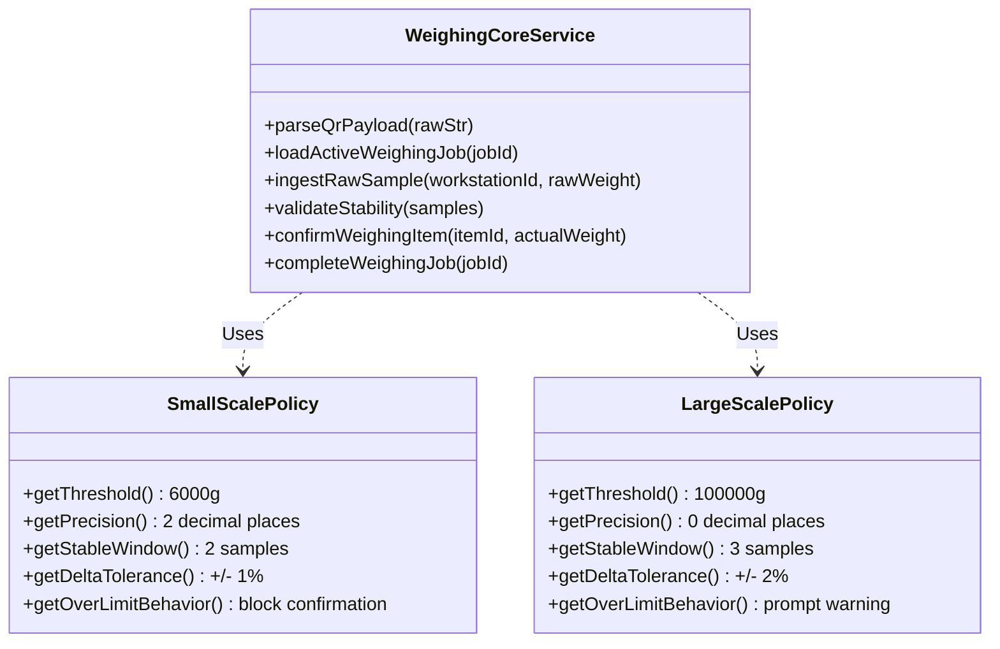

# Định tuyến trạm cân và Thiết kế Weighing Core (weighing-workstation-routing.md)

Tài liệu này đặc tả quy tắc định tuyến mẻ cân sang trạm Cân nhỏ (`SMALL_SCALE`) hoặc Cân lớn (`LARGE_SCALE`), đồng thời thiết kế cấu trúc tái sử dụng mã nguồn thông qua bộ đôi **Weighing Core** và **Scale Policies**.

---

## 1. Ma trận định tuyến thiết bị cân (Scale Routing Matrix)

### 1.1. Khảo sát nghiệp vụ gốc từ VBA
Qua rà soát mã nguồn của 2 workbook cân (`4.semiauto-small scale ...` và `5.Semiauto- lockmove ...`), **không tìm thấy bất kỳ quy tắc tự động phân tách cứng nào dựa trên dữ liệu QR**.
- Cả hai workbook đều có cấu trúc đọc chuỗi thô tương đồng.
- Trên thực tế tại nhà xưởng, việc phân tách dựa trên sự phân loại vật lý của vật liệu cân và hướng dẫn vận hành trực tiếp của trưởng ca.
- **Trạng thái Blocker:** **`CH-BUS-016`** (Cần người dùng chốt quy tắc tự động định tuyến nếu có, ví dụ phân chia theo ngưỡng khối lượng mẻ cân).

### 1.2. Ma trận quy tắc đề xuất (Legacy Condition Routing)

| Điều kiện phân loại | Trạm Cân nhỏ (`SMALL_SCALE`) | Trạm Cân lớn (`LARGE_SCALE`) | Bằng chứng / Cơ sở nghiệp vụ |
|---|---|---|---|
| **Khối lượng (Weight)** | Dưới $6.00 \text{ kg}$ ($6000 \text{ g}$) | Từ $6.00 \text{ kg}$ trở lên | VBA-SCALE-OVER6: Cơ chế phân đợt gửi của cân lớn kích hoạt khi mẻ > 6 racks |
| **Loại vật tư (Material)** | Thuốc nhuộm dạng bột (Dye), hóa chất tinh khiết | Hóa chất phụ trợ số lượng lớn (Muối, Soda, chất điện ly) | Dựa trên độ chính xác của cảm biến cân (Loadcell) |
| **Độ chính xác yêu cầu** | Sai số cho phép: $0.01 \text{ g}$ đến $0.1 \text{ g}$ | Sai số cho phép: $1 \text{ g}$ đến $10 \text{ g}$ | Đặc tính kỹ thuật của thiết bị cân thật |
| **Rack / Thùng chứa** | Dưới 6 Racks | Trên 6 Racks (Áp dụng cơ chế LOCKMOVE chia đợt) | VBA-SCALE-088: Cơ chế chia nhỏ đợt cân để in nhiều tem phụ |

---

## 2. Thiết kế Kiến trúc phần mềm: Weighing Core & Policies

Để tránh việc copy-paste mã nguồn gây trùng lặp và phát sinh lỗi, hệ thống Web sử dụng cấu trúc thiết kế hướng đối tượng tách biệt phần xử lý luồng cốt lõi (Core) và phần quy tắc nghiệp vụ đặc thù của từng loại cân (Policies).

### 2.1. Thành phần dùng chung (Weighing Core)
Chịu trách nhiệm thực thi quy trình nghiệp vụ cân chuẩn:
1.  **QR Parsing:** Giải mã chuỗi thô QR theo định dạng giao ước (Data Contract).
2.  **Raw Sample Ingestion:** Tiếp nhận số liệu cân thô liên tục (500ms/lần) gửi từ Local Agent.
3.  **Duplicate Detection:** Chống ghi đè số cân cho các dòng vật tư đã hoàn thành.
4.  **Tolerance Check:** So sánh số cân thực tế với định mức mục tiêu, kiểm tra xem có nằm trong khoảng dung sai hay không.
5.  **Completion & Audit:** Lưu kết quả cân vào database (`app.weighing_results` $\rightarrow$ tương đương `tblRECORD` của RECORD_B) và ghi Audit Log.

### 2.2. Thành phần quy tắc riêng (Scale Policies)

#### 1. SmallScalePolicy (Áp dụng cho Cân nhỏ)
- **Độ chính xác hiển thị (Precision):** 2 chữ số thập phân (ví dụ `12.50 g`).
- **Cơ chế ổn định số cân (Stability Window):** Yêu cầu 2 mẫu thử liên tiếp có giá trị chênh lệch tuyệt đối $< 0.1\text{g}$ mới coi là ổn định.
- **Hành vi vượt giới hạn:** Khóa cứng nút xác nhận nếu nằm ngoài dung sai cho phép và chưa được QA/QC duyệt Override.

#### 2. LargeScalePolicy (Áp dụng cho Cân lớn)
- **Độ chính xác hiển thị (Precision):** Không lấy phần thập phân (ví dụ `6500 g` - làm tròn số nguyên).
- **Cơ chế ổn định số cân (Stability Window):** Yêu cầu 3 mẫu thử liên tiếp giống nhau tuyệt đối (do cân sàn lớn có độ rung cơ học cao hơn).
- **Khắc phục lỗi hiển thị màu Accepted/Rejected:** Hệ thống cũ của cân lớn bị lỗi hiển thị nhầm màu đỏ khi đạt dung sai và màu xanh khi sai số. `LargeScalePolicy` kiểm tra đúng dung sai và trả về mã màu nhất quán (Xanh = Đạt, Đỏ = Sai lệch).
- **Khắc phục rò rỉ bộ đếm thời gian (Timer Leak):** Toàn bộ các bộ đếm thời gian (Interval/Timeout) lắng nghe cân sàn của LargeScale được giải phóng hoàn toàn khi chuyển đổi màn hình hoặc kết thúc phiên cân, không để chạy ngầm gây tràn bộ nhớ Kiosk.
